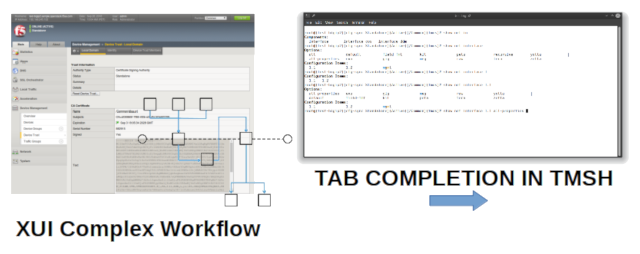
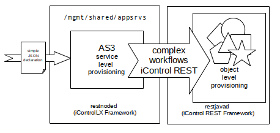
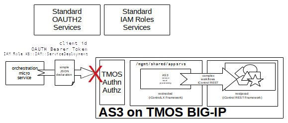
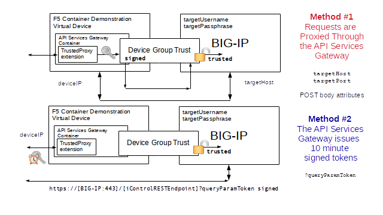
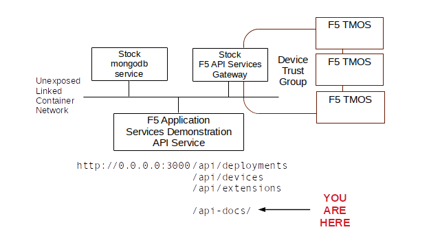
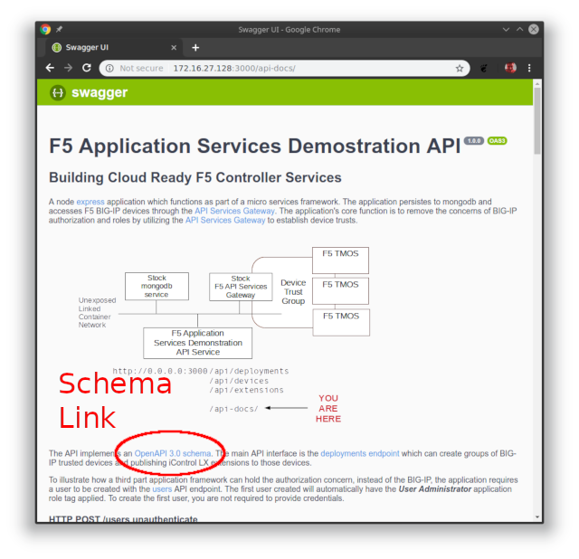
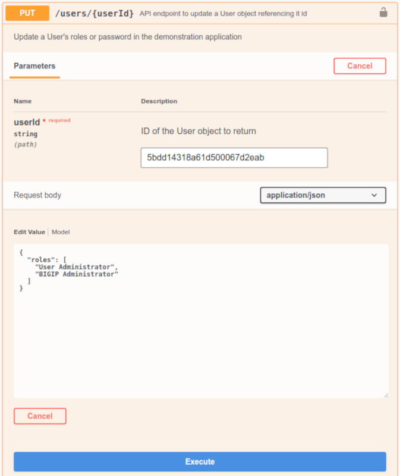

<link href="./assets/css/bootstrap.min.css" rel="stylesheet"></link>
<link href="./assets/css/f5.css" rel="stylesheet"></link>

F5 Container Based Solutions to Provision BIG-IPs
========================

1. [What is the API Services Gateway Container?](#what-is-the-api-service-gateway-container-)
2. [What is the AS3 Container?](#what-is-the-as3-container-)
3. [Why Are We Releasing New APIs and Containers?](#why-are-we-releasing-new-apis-and-containers-)
    - [Simplifying BIG-IP Orchestration Through Declarative APIs](#simplifying-big-ip-orchestration-through-declarative-apis)
    - [We Started Declaring with AS3](#we-started-declaring-with-as3)
    - [There Is Still More to Declare](#there-is-still-more-to-declare)
4. [Deep Integration into an Orchestration Ecosystem](#deep-integration-into-an-orchestration-ecosystem)
    - [The API Service Gateway Manifesto](#the-api-service-gateway-manifesto)
5. [Which Option to Choose for a Customer or Partner](#which-option-to-choose-for-a-customer-or-partner)

F5 Container Orchestration Exercises
-------------------
6. [AS3 Container Exercises](#as3-container-exercises)
    - [Exercise #1 - Downloading and Launching the AS3 Container with docker](#exercise-1-downloading-and-launching-the-as3-container-with-docker)
    - [Exercise #2 - Declaring BIG-IP Services through the AS3 Container](#exercise-2-declaring-big-ip-services-through-the-as3-container)
7. [F5 API Services Gateway Exercises](#f5-api-services-gateway-exercises)
    - [Exercise #3 - Downloading and Launching the API Services Gateway with docker](#exercise-3-downloading-and-launching-the-api-services-gateway-with-docker)
    - [Exercise #4 - Creating a Trust Between the API Service Gateway and Remote BIG-IPs](#exercise-4-creating-a-trust-between-the-api-service-gateway-and-remote-big-ips)
    - [Exercise #5 - Installing TrustedProxy iControl LX Extension on the API Services Gateway](#exercise-5-installing-the-trustedproxy-icontrol-lx-extension-on-the-api-services-gateway)
    - [Exercise #6 - Issuing iControl REST Requests Through the TrustedProxy iControl LX Extension](#exercise-6-issuing-icontrol-rest-requests-through-the-trustedproxy-icontrol-lx-extension)
    - [Exercise #7 - Removing a Trust Between the API Service Gateway and a Remote BIG-IP](#exercise-7-removing-a-trust-between-the-api-services-gateway-and-a-remote-big-ip)
    - [Exercise #8 - Designing a TrustedDevices iControl LX Extension from JSON Schema](#exercise-8-designing-a-trusteddevices-icontrol-lx-extension-from-json-schema)
    - [Exercise #9 - Using the TrustedProxy iControl LX Extension As A Token Service](#exercise-9-using-the-trustedproxy-icontrol-lx-extension-as-a-token-service)
    - [Exercise #10 - TrustedExtensions iControl LX Extension on the API Services Gateway](#exercise-10-trustedextensions-icontrol-lx-extension-on-the-api-services-gateway)

Integration Exercises
--------------------
8. [Demonstration Integration Exercises](#demonstration-integration-exercises)
    - [Exercise #11 - Launching The Micro Services Deployment with docker-compose](#exercise-11-launching-the-micro-services-deployment-with-docker-compose)
    - [Exercise #12 - Installing iControl LX Extensions On Multiple Remote BIG-IPs](#exercise-12-installing-icontrol-lx-extensions-on-multiple-remote-big-ips)
    - [Exercise #13 - Making Trusted Declarations to Multiple Remote BIG-IPs](#exercise-13-making-trusted-declarations-to-multiple-remote-big-ips)

Summary
--------------------
9. [The API Service Gateway in Next Generation Partner Ecosystems](#the-api-service-gateway-in-next-generation-partner-ecosystems)
10. [How Can I Capitalize On Our New F5 Orchestration Containers?](#how-can-i-capitalize-on-our-new-f5-orchestration-containers-)

---

F5 now offers two container based solutions to aid in the orchestrated provisioning of BIG-IP services.

- [The API Services Gateway Container](#what-is-the-api-service-gateway-container-)
- [The AS3 Container](#what-is-the-as3-container-)

What is the API Service Gateway Container?
-------------------

The [API Service Gateway Container](https://hub.docker.com/r/f5devcentral/f5-api-services-gateway/) is a docker built container which runs both the iControl REST framework (restjavad) and the iControl LX extension framework (restnoded). 

The API Services Gateway container allows for the installation and operation of iControl LX extensions outside of a BIG-IP.  This enables opportunities for F5, or our customers and partners who are familiar with the iControl LX extensions framework, to run complex iControl REST orchestration workflows in a container, rather then consuming resources on their BIG-IP's control planes.

In addition to housing iControl LX extensions, the API Services Gateway can be used to create trusted device groups. These device groups establish a certificate based trust between the container and remote BIG-IP devices. Local iControl LX extensions, running within container, can make signed iControl REST requests to peer BIG-IP device without providing TMOS credentials or establishing separate iControl REST session tokens. 

Typically iControl REST requires the establishment of a disticnt session token with each device. The aquistion of the token requires knowledge of a TMOS username and password which is valid for the remote BIG-IP device. For iControl REST based orchestration projects this has meant the proliferation of TMOS credentials throughout all services requiring access to the BIG-IPs. Too often, these credentials hold TMOS Administrator privledges because of the nature of the iControl REST requests being made. These same TMOS credentials could be use to access the XUI GUI or SSH terminal sessions. An unintended consequence of orchestration has been the expose of TMOS systems to the risk of *'leaked'* credentials.

With the API Services Gateweay, trusted REST calls are signed by the container and the signature is validated on the remote target BIG-IP. If the signature is issued from a member of our trusted device group, the request is carried out with Administrator role permissions on the remote BIG-IP. This is the same process and security used to synchronize configurations between peer TMOS devices. The API Service Gateway thus premits a division of labor where, once a BIG-IP administration process creates the device trust with BIG-IP credentials, other subsequent processes running within the container can be trusted to make iControl REST requests without being concerned with TMOS credentials. This confines the requirement for TMOS credentials to only the API Service Gateway, and then only for the processes of creating the device trust group.


*The API Services Gateway container is not a generalized API security proxy.* It is simply a way of extending our integration options in a cloud native way.

In fact, utilizing the API Services Gateway container to establish trusts removes the need for F5 security on each iControl REST call to remote BIG-IPs. When the F5 security is removed from individual requests, third party security should be used to enforce proper access controls to provision BIG-IP services. Securing access to API endpoints is a major role which is already provided for in most service ecosystems. The API Services Gateway increases the ease of integration for provisioning F5 services to an ecosystem, but then relies on the ecosystem's native security to authorize requests made to the gateway container.

**Note:** The iControl LX extension framework is purpose built to service the orchestration of iControl REST calls issued to TMOS devices. It is *NOT* suitable as a generalized middleware framework. The iControl LX extension framework filters inbound requests in ways that make it impossible to implement common middleware schemes; such as the injection of identity tokens or anti-tampering measures. The intention of the iControl LX extension framework is to interact with TMOS deviecs, not external systems. The API Services Gateway container is intended to be used with other linked containers which facilitate interaction with other external systems as part of a micro-services deployment.

The API Services Gateway container is available with community support. As the intention of the container is to become F5's component in a ecosystem of deployed services. The supportability of the complete orchestration would naturally be beyond F5's scope. We only handle our part of the overall orchestration.


What is the AS3 Container?
-------------------

The AS3 Container is an F5 optimized API Service Gateway which has the AS3 iControl LX extension pre-installed.

The AS3 Container does not utilize device group trusts. F5 device level authentication and authorization is still enforced by each remote BIG-IP device. The credentials for remote target AS3 deployments are included in the tenant declarations posted to the AS3 container.

The AS3 container is only intended to support the pre-installed AS3 iControl LX extension. The customer should not expect to extend or alter the AS3 container in any way. You run it and use it.

Because the AS3 container's functionality stands alone, without any dependencies on the customer's ecosystem of services, it can be maintained as a fully supported F5 product.


Why Are We Releasing New APIs and Containers?
-------------------

For the most part, we have successfully migrated our customers and partners who are interested in orchestration to iControl REST. Why introduce new APIs for BIG-IP?

### Simplifying BIG-IP Orchestration Through Declarative APIs ###

As BIG-IP administration increasingly becomes the job of automation, rather than human administrator interaction, focusing our efforts on simple declarative API interfaces will help our customers standardize their BIG-IP services, increases the agility of operations, and open the orchestration of the TMOS platform to a much larger ecosystem of external cloud services.

For human administrator's, F5 has augmented the ease of use of TMOS devices in many ways. The XUI Web Graphical Interface performs complex provisioning workflows in behalf of the administrator. The TMSH CLI client uses smart tab completion to assist the administrator with available options for provisioning tasks.



The complexities of remote provisioning BIG-IP services through iControl REST APIs has been a major hurdle for our customers in their efforts to automated. In our traditional 'programmable' fashion, F5 introduced a scriptable framework allowing BIG-IP experts to take very complex provisioning interactions, or workflows, and expose them to non-F5 expert API tenants in a simplified way. The scripting language chosen was javascript. The scriptable APIs are made available as URL namespace *'extensions'* to the existing iControl REST URL schemas, which start with `/mgmt/` on every TMOS device.

```
/mgmt/{{simplified API namespace}}
```

The interaction of the scripted workflows with the existing iControl REST API is handled through a set of javascript objects. These objects were called the *iControl LX extension framework*. In addition, web based UI extensions were enabled, called iApps  LX, allowing the F5 experts to define custom UI elements which can be accessed as part of the BIG-IP device's XUI web graphical interface.

[iControl LX Documentation](https://clouddocs.f5.com/products/iapp/iapp-lx/tmos-14_0/) is part of the clouddocs.f5.com effort.

We will not discuss iApps  LX graphical presentations, only the API extensions made available with iControl LX.

Just because a framework exists, like iControl LX extensions, does not mean that the API endpoints exposed by that framework are easy to use. To that end, F5 began to follow a trend in orchestrated provisioning known as *'declarative interfaces'*. In general, declarative interfaces no longer require the end user to understand the stages and processes by which a system achieves a deployment, but rather simply defines the end service state of a system. 

Here is a an example of a YAML declarative deployment for a containerized proxy using the Kubernetes orchestrator.

```YAML
apiVersion: apps/v1
kind: Deployment
metadata:
  name: www-deployment
  labels:
    app: www
spec:
  replicas: 3
  selector:
    matchLabels:
      app: www
  template:
    metadata:
      labels:
        app: www
    spec:
      containers:
        - name: nginx
          image: nginx:1.7.9
          ports:
            - containerPort: 80
          volumeMounts:
            - mountPath: "/usr/share/nginx/html"
              name: web-pv-storage
---
apiVersion: v1
kind: Service
metadata:
  name: proxy-svc
spec:
  ports:
  - port: 8080
    targetPort: 80
    protocol: TCP
    name: http
  selector:
    app: www
```

Notice there is nothing in the YAML declaration which pertains to the steps to take in the proxy's configuration or entries in configuration files. The point of the declarative interface is to decouple and free the API tenant from any such concerns. This notion of decoupling is known as *'separation of concerns'* and is a basic concept in cloud ready deployments. In cloud, you decompose your systems into independent service interfaces which are only concerned about their part of the overall solution. As as system decomposes into smaller and smaller chunks of system functionality, these decomposed interfaces are referred to as *'micro services'*.

### We Started Declaring with AS3 ###

Application Services 3 Extension (AS3) is the first supported declarative API for BIG-IP. AS3 endeavors to expose many advanced BIG-IP services while still hiding as many of the 'BIG-IP concerns' as possible. AS3 is an iControl LX extension which, once installed on a system supporting the iControl LX framework, can be accessed at the iControl REST endpoint:

```
/mgmt/shared/appsvcs
```

[Application Services 3 Extension Documentation](https://clouddocs.f5.com/products/extensions/f5-appsvcs-extension/3/) is part of the clouddocs.f5.com effort.

The AS3 iControl LX extension endpoint accepts a declaration defined by a standards based [JSON schema](https://json-schema.org). AS3 JSON schema allows for an entire BIG-IP's data plane services to be deployed through one declaration, in one REST call. The AS3 JSON schema includes the ability to define multiple tenants. We call the divisions tenants, verses the BIG-IP concept of partitions, because the API user should not be concerned that BIG-IP has partitions. In cloud, these divisions are typically defined as tenants, not partitions. In fact, if BIG-IP stopped supporting separations with partitions, the API definition of a tenant could remain unchanged. We are quite careful when we define the schema of our declarative APIs to make sure the concepts can be preserved as we pivot to our next generation of application delivery products.



AS3's is constantly being enhanced to include declaration attributes which enable more BIG-IP services. AS3's aggressive agile based development cycle allows for the release of new AS3 versions on a much shorter release cycle than a full TMOS release. The development team demonstrates and tests new functionality for AS3 every two weeks.

### There Is Still More to Declare ###

Other declarative iControl LX extensions are being developed to simplify additional complex TMOS tasks. As an example, AS3 performs extensive validation before implementing its workflows. There are times where AS3's design might not lend itself to the frequency of automation requests possible in an given ecosystem. For such situations, other declarative APIs could work with AS3 to allow for rapid interaction with specific BIG-IP service objects.

As another example, AS3 does not handle any system-wide onboarding tasks. Other declarative APIs are being developed to handle those type of orchestration requests.

When complex orchestration tasks can be built into standalone micro services, supported containers, like the AS3 container, can become the release packaging. The AS3 container is an example of a standalone micro service just for AS3. Another example of a proposed standalone micro service we are considering, is a container build which unifies the creation and auto-scaling of TMOS VEs in multiple cloud environments. The intent for all such future standalone container builds is to provide simple *'run and then use'* orchestrations.

All of our declarative APIs and micro service container builds follow the same aggressive development process. Our aim is to be able to provide the simplicity necessary for F5 services to function well in orchestrated environments at the agile pass of our customer's cloud native deployments. 

Deep Integration into an Orchestration Ecosystem
-------------------

When declarative iControl LX services are deployed on existing TMOS platforms, they inherit TMOS' system level services, including network access, authentication services, and defined role based authorization. This works well where existing TMOS configurations for corporate identity, like active directory, and network access systems, like established network firewall policies, are already available. However, TMOS' lack of support for cloud native identity systems, TMOS' notions of roles, and the inflexibility of TMOs' tenancy model make integration in the increasingly opinionated world of cloud orchestation extremely cumbersome.



When TMOS forces the exposure of BIG-IP concepts to cloud service API tenants, we are not properly observing *'separation of concerns'* for our customers. The cloud won't change for F5, F5 needs to change for the cloud.

In the past F5 has tried to accommodate specific partner ecosystem deployments, for example Cisco APIC or OpenStack Neutron. We did this by creating dedicated agent processes which work inside of the partner's controllers to *translate* requests into the workflows needed to provision BIG-IPs. Partner feature dependencies and multiple version testing have proven extremely fragile and complex to maintain.  Fortunately, the technology world had the same problem we did, that of supporting the lifecycle of their sofrware in the diversity of cloud services. A better way to handle software deployments in complex ecosystems based on process virtualization has take over our industry. *Containerization*!

What can F5 do to enable deep integration now that ubiquitous containerization has become available in our customer's environments?

*We create our own containers which hides as many of the complexities of integrating with TMOS platforms as possible. That is the reason for the generalized [API Service Gateway Container](https://hub.docker.com/r/f5devcentral/f5-api-services-gateway/). The API Service Gateway container can be integrated into micro service based controllers in ways that make orchestrated provisioning of TMOS devices appear native to the customer's services. Because of containerization, we can combine the simplicity of our new iControl LX extension declarative APIs with partner ecosystems services without forcing a costly and fragile deployment of one-off, ecosystem specific F5 agents.* 

### The API Service Gateway Manifesto ###

#### **_Our customers should be able to utilize the advanced services we offer with BIG-IP without being concerned about the TMOS system complexities we use to deploy those services._** ####

The marriage of housing our declarative iControl LX extensions and the ability to establish trusted communications with remote BIG-IPs make the API Services Gateway the basis for building F5's components within an ecosystem's orchestrated deployment of containers. 

**Note:** The API Services Gateway is never intended to be the workflow engine at the heart of a deep ecosystem integration. The F5 frameworks it contains are simply not flexible enough to support that functionality. It is intended to remove *'TMOS concerns'* from the other elements in a deep ecosystem integration project. Interactions with other services in an ecosystems should be handled by other containerized elements which isolate the concerns of those services. In micro-services, cloud ready, fashion, each element plays their role and only their role.

Which Option to Choose for a Customer or Partner
-------------------

#### F5 BIG-IQ is the *out of the box* solution for BIG-IP management. ####

- *If a customer wants a graphical user interface to manage BIG-IP devices, BIG-IQ provides that interface.*

- *If a customer wants the ease of use declarative APIs for BIG-IP services available on an F5 managed platform, BIG-IQ 6.1 adds AS3 API endpoints for BIG-IQ managed devices. BIG-IQ will deploy AS3 on remote BIG-IPs and will apply analytics to AS3 declared services.*

#### If your customer or partner is looking for a simplified way to fully control the provisioning of BIG-IPs as part of their own orchestrated services, we now offer container based solutions. ####

- *If a customer wants a standalone way to provision BIG-IP services through a declarative API, the AS3 container performs that function.*

- *If a customer or partner needs deep integration of BIG-IPs services into an ecosystem of cloud services, the API Service Gateway provides the basis for F5's components of such a solution.*

### Summary of Solutions ###

| F5 Solution                           | Support Model| Usage                                                              |
| :------------------------------------ | :----------- | :----------------------------------------------------------------- |
| F5 BIG-IQ                             | Full         | Full Device Management with a Graphical Environment                |
| F5 BIG-IQ with AS3                    | Full         | Full Device Management with the Ease of Use Declarative API        |
| F5 AS3 Container                      | Full         | Ease of Use Declarative API as a Stand Alone Micro Service         |
| F5 API Services Gateway &nbsp; &nbsp; | Community    | F5's Components of an Integration into an Cloud Services Ecosystem |

---

F5 Container Orchestration Exercises
========================

---

AS3 Container Exercises
-------------------

We will deploy the AS3 Container and then declare a BIG-IP device configuration.

In these exercises you will need:

- A target BIG-IP system whose management address is reachable from the container
- Administrative role credentials to the BIG-IP
- A running instance of the F5 Container Demonstration Virtual Device


---

### Exercise #1 - Downloading and Launching the AS3 Container with ```docker```

Step 1. Create a SSH connection to the F5 Container Demonstration Virtual Device

You can Obtain the IP address of your booted F5 Container Demonstration Virtual Device by opening its console. 


In this example, the IP address would be 192.168.185.129. Your address will likely be different.

If the Host entry IP address is blank, please assure your network interface is properly conntected to a network.

<div class='webcontent'>

Fill in the form below to create your cut-n-paste examples for these exercises.

---

| Attribute                               | Explaination                                                              |
| :------------------------------------   | :------------------------------------------------------------------------ |
| deviceIP                                | The F5 Container Demonstration Virtual Device IP Address                  |
| targetHost                              | The iControl REST remote BIG-IP host, reachable from the container        |
| targetUsername                          | The iControl REST username on the remote BIG-IP                           |
| targetPaaphrase                         | The iControl REST password on the remote BIG-IP                           |

---

<script>
function buildAS3Exercises()
{

    var deviceIp = document.getElementById('as3-container-container-demonstration-virtual-device-ip').value;
    var targetHost = document.getElementById('as3-container-exercises-targetHost').value;
    var targetUsername = document.getElementById('as3-container-exercises-targetUsername').value;
    var targetPassphrase = document.getElementById('as3-container-exercises-targetPassphrase').value;

    var ssh_login = `ssh f5admin@` + deviceIp + `
f5admin@` + deviceIp + `'s password: f5admin`;

    var as3_version_command = `curl -k -s https://localhost:8443/mgmt/shared/appsvcs/info|json_pp
`;

    var as3_version_command_output = `
{
   "schemaMinimum" : "3.0.0",
   "release" : "3",
   "version" : "3.5.0",
   "schemaCurrent" : "3.5.0"
}
`

    var as3_retrieve_command = `curl -k -s -H 'Content-Type: application/json' -X POST https://localhost:8443/mgmt/shared/appsvcs/declare -d '{
    "class": "AS3",
    "action": "retrieve",
    "targetHost": "` + targetHost + `",
    "targetUsername": "` + targetUsername + `",
    "targetPassphrase": "` + targetPassphrase + `"
}'
`;

    var as3_retrieve_command_output = `f5admin@containerhost:~$ <b>curl -k -s -H 'Content-Type: application/json' -X POST https://localhost:8443/mgmt/shared/appsvcs/declare -d '{
    "class": "AS3",
    "action": "retrieve",
    "targetHost": "` + targetHost + `",
    "targetUsername": "` + targetUsername + `",
    "targetPassphrase": "` + targetPassphrase + `"
}'|json_pp

f5admin@containerhost:~$ <-- Notice no response output!

`;
    var as3_retrieve_command_output_post_to_remote_bigip = `f5admin@containerhost:~$ curl -u '`+targetUsername+`:`+targetPassphrase+`' -k -s -H 'Content-Type: application/json' -X POST https://` + targetHost + `/mgmt/shared/appsvcs/declare -d '{
>     "class": "AS3",
>     "action": "retrieve"
> }'|json_pp

{
	"statusCode": 404,
	"message": "declaration 0 not found",
	"code": 404
}
`;

    var as3_retrieve_command_output_get_to_remote_bigip = `f5admin@containerhost:~$ curl -u '`+targetUsername+`:`+targetPassphrase+`' -k -s -H 'Content-Type: application/json' https://` + targetHost + `/mgmt/shared/appsvcs/declare|json_pp

{
	"statusCode": 404,
	"message": "declaration 0 not found",
	"code": 404
}
`;


    var as3_declare_command = `curl -k -s -H 'Content-Type: application/json' -X POST https://localhost:8443/mgmt/shared/appsvcs/declare -d '{
    "class": "AS3",
    "action": "deploy",
    "targetHost": "` + targetHost + `",
    "targetUsername": "` + targetUsername + `",
    "targetPassphrase": "` + targetPassphrase + `",
    "declaration": {
        "class": "ADC",
        "schemaVersion": "3.0.0",
        "id": "container",
        "label": "Sample 1 in a container",
        "remark": "Simple HTTP application with RR pool",
        "Sample_container": {
            "class": "Tenant",
            "A1": {
                "class": "Application",
                "template": "http",
                "serviceMain": {
                "class": "Service_HTTP",
                "virtualAddresses": [
                    "10.0.1.10"
                ],
                "pool": "web_pool"
                },
                "web_pool": {
                "class": "Pool",
                    "monitors": [
                        "http"
                    ],
                "members": [{
                    "servicePort": 80,
                    "serverAddresses": [
                        "192.0.1.10",
                        "192.0.1.11"
                    ]
                }]
                }
            }
        }
    }
}'|json_pp
`;

    var as3_remove_command = `curl -k -s -H 'Content-Type: application/json' -X POST https://localhost:8443/mgmt/shared/appsvcs/declare -d '{
    "class": "AS3",
    "action": "remove",
    "targetHost": "` + targetHost + `",
    "targetUsername": "` + targetUsername + `",
    "targetPassphrase": "` + targetPassphrase + `"
}'|json_pp
`;

    var command_header = `<h4>cut-n-pase command:</h4><code>
    <div style='white-space: pre; font-weight: bold; display: block; border: 1px solid #ccc; border-radius: 0; margin: 0 0 11px; padding: 10.5px;background-color: #f5f5f5;'>`;
    var command_footer = `</div></code>`;
    var sample_header = `<pre>`;
    var sample_footer = `</pre>`;

    document.getElementById('as3-ssh-login').innerHTML = command_header + ssh_login + command_footer;
    document.getElementById('get-as3-version').innerHTML = command_header + as3_version_command + command_footer;
    document.getElementById('get-as3-version-output').innerHTML = sample_header + as3_version_command_output + sample_footer;
    document.getElementById('get-as3-existing-declaration-command').innerHTML = command_header + as3_retrieve_command + command_footer;
    document.getElementById('get-as3-existing-declaration-command-output').innerHTML = sample_header +as3_retrieve_command_output + sample_footer;
    document.getElementById('get-as3-existing-declaration-post-to-remote-bigip').innerHTML = sample_header + as3_retrieve_command_output_post_to_remote_bigip + sample_footer;
    document.getElementById('get-as3-existing-declaration-get-to-remote-bigip').innerHTML = sample_header + as3_retrieve_command_output_get_to_remote_bigip + sample_footer;
    document.getElementById('as3-declare-example').innerHTML = command_header + as3_declare_command + command_footer;
    document.getElementById('as3-remove-example').innerHTML = command_header + as3_remove_command + command_footer;

}
</script>

<form id='as3-container-exercises-variables'>
<table>
<tr><th>deviceIP: </th><td><input id='as3-container-container-demonstration-virtual-device-ip' placeholder='Device IP'></td></tr>
<tr><th>targetHost: </th><td><input id='as3-container-exercises-targetHost' placeholder='BIG-IP IP Address'></td></tr>
<tr><th>targetUsername: </th><td><input id='as3-container-exercises-targetUsername' placeholder='BIG-IP Username'></td></tr>
<tr><th>targetPassphrase: </th><td><input id='as3-container-exercises-targetPassphrase' placeholder='BIG-IP Password'></td></tr>
<tr><td>&nbsp;</td></tr>
<tr><td colspan='2'><input type='button' onclick='buildAS3Exercises()' value=' Generate Exercises Cut-n-Paste Commands '></td></tr>
</table>
</form>

</div>

Start your ssh client and login with the username, password, and host shown on the console.

<div id='as3-ssh-login'>

**`ssh f5admin@[Your F5 Container Demonstration Device IP]`**

```
f5admin@[Your F5 Container Demonstration Device IP]
f5admin@[Your F5 Container Demonstration Device IP]'s password: f5admin
```

</div>

```
Welcome to F5 Container Demo Virtual Device (GNU/Linux 4.15.0-36-generic x86_64)

Running Containers: 

CONTAINER ID        IMAGE               COMMAND             CREATED             STATUS              PORTS               NAMES

Last login: Sat Sept 1 09:32:55 2018 from 172.16.27.1
f5admin@containerhost:~$ 

```

Step 2. Pull the AS3 Container from Dockerhub

**`docker pull f5devcentral/f5-as3-container`**

```
f5admin@containerhost:~$ docker pull f5devcentral/f5-as3-container
Using default tag: latest
latest: Pulling from f5devcentral/f5-as3-container
911c6d0c7995: Pulling fs layer
....
....
6ce7b086198f: Pull complete 
Digest: sha256:9ccf5a8e18699742440ea50b9023a9728987d04da4710869e8964d36bcf1d552
Status: Downloaded newer image for f5devcentral/f5-as3-container:latest

```

Step 3. Create a running instance of the AS3 Container

**`docker run --name as3_container --rm -d -p 8443:443 -p 8080:80 f5devcentral/f5-as3-container:latest`**

```
f5admin@containerhost:~$ docker run --name as3_container --rm -d -p 8443:443 -p 8080:80 f5devcentral/f5-as3-container:latest
478d06836ee38fdd48f89e267d7b91c9d3bfb9538c0602e3fdb444062e2f3e54
```
List the running containers.

**`docker ps`**

```
f5admin@containerhost:~$ docker ps
CONTAINER ID        IMAGE                                  COMMAND             CREATED             STATUS              PORTS                                         NAMES
478d06836ee3        f5devcentral/f5-as3-container:latest   "/etc/runit/boot"   8 seconds ago       Up 7 seconds        0.0.0.0:8080->80/tcp, 0.0.0.0:8443->443/tcp   as3_container

```

### Exercise #2 - Declaring BIG-IP Services through the AS3 Container

**Step 1. Vaidate the version of the AS3 iControl Extension in the AS3 Container**

Issue an iControl REST GET request to the AS3 Container with URL ```/mgmt/shared/appsvcs/info``

**Use curl in the F5 Container Demonstration Device SSH session**

<div id='get-as3-version'>

```
f5admin@containerhost:~$ curl -k -s  https://localhost:8443/mgmt/shared/appsvcs/info|json_pp
{
   "schemaMinimum" : "3.0.0",
   "release" : "3",
   "version" : "3.5.0",
   "schemaCurrent" : "3.5.0"
}
```

</div>

<div id='get-as3-version-output'>

</div>

You should see a returned JSON object which shows the version of the AS3 iControl LX Extension which was pre-installed in the AS3 Container. 

**Note:** While the iControl REST endpoint is on the AS3 Container, our desire is to make AS3 declarations against remote BIG-IP hosts. Creating a remote configuration for an AS3 declaration is done by including 3 additional attributes. The presence of the `targetHost`, `targetUsername`, `targetPassphrase` attributes in the declaration informs the AS3 iControl LX extension that is should not issue iControl REST requests to `localhost`, but should authenticate and issue iControl REST requests to the `targetHost`. We will be including these attributes in all our requests to the AS3 Container endpoint. 

**Note:** Since declaration attributes are required to target remote BIG-IPs, we won't be able to make HTTP GET or DELETE requests, which by RFC can not contain a request body, for any remote declarations. You can query the version from the iControl LX extension with a GET request, but any requests to manage a declaration on a remote BIG-IP must use POST or PATCH methods.

**Step 2. Get any existing AS3 declaration on a remote BIG-IP**

**Use curl in the F5 Container Demonstration Device SSH session**

<div id='get-as3-existing-declaration-command'>

```
f5admin@containerhost:~$ curl -k -s -H 'Content-Type: application/json' -X POST https://localhost:8443/mgmt/shared/appsvcs/declare -d '{
    "class": "AS3",
    "action": "retrieve",
    "targetHost": "[Your targetHost]",
    "targetUsername": "[Your targetUsername]",
    "targetPassphrase": "[Your targetPassphrase]"
}'
```

</div>

If you recieve no response output like this:

<div id='get-as3-existing-declaration-command-output'>

```
f5admin@containerhost:~$ curl -k -s -H 'Content-Type: application/json' -X POST https://localhost:8443/mgmt/shared/appsvcs/declare -d '{
    "class": "AS3",
    "action": "retrieve",
    "targetHost": "[Your targetHost]",
    "targetUsername": "[Your targetUsername]",
    "targetPassphrase": "[Your targetPassphrase]"
}'|json_pp

f5admin@containerhost:~$ <-- Notice no response output!
```

</div>

you likely don't have a previously deployed AS3 declaration. In fact if you add the `--version` flag to your `curl` command, you will see you got a `204` response.

**NOTE:** AS3 Container `POST` requests with defined `targetHost` and `actions` attributes *do not* always mirror the responses of an AS3 iControl LX extension installed on a BIG-IP. This is important to note when writing tests. You will want to validate your requests against the AS3 container, not just AS3 iControl LX extensions installed locally on BIG-IPs.

As an example, assuming you have the AS3 iControl LX extension installed on your remote BIG-IP, when you place both the `POST` and `GET` requests to `/mgmt/shared/appsvcs/declare` without a deployed declaration you'll get `404` responses, not the `204` response returned from the AS3 Container.

Note the response issuing a `POST` request and the `retrieve` action on AS3 installed on your remote BIG-IP:

<div id='get-as3-existing-declaration-post-to-remote-bigip'>

```
f5admin@containerhost:~$ curl -u 'admin:admin' -k -s -H 'Content-Type: application/json' -X POST https://[Your targetHost]/mgmt/shared/appsvcs/declare -d '{
>     "class": "AS3",
>     "action": "retrieve"
> }'|json_pp
{
	"statusCode": 404,
	"message": "declaration 0 not found",
	"code": 404
}
```

</div>

Note the response issuing a `GET` request on AS3 installed on your remote BIG-IP:

<div id='get-as3-existing-declaration-get-to-remote-bigip'>

```
f5admin@containerhost:~$ curl -u 'admin:admin' -k -s -H 'Content-Type: application/json' https://[Your targetHost]/mgmt/shared/appsvcs/declare|json_pp
{
	"statusCode": 404,
	"message": "declaration 0 not found",
	"code": 404
}
```

</div>

**Step 3. Issue an AS3 declaration to the a remote BIG-IP**

Issue the sample declaration from the AS3 clouddocs documentation to the AS3 Container endpoint. We will add the `targetHost`, `targetUsername`, and `targetPassphrase` attributes in the declaration, thus deploying the declaration to your remote BIG-IP.

**Use curl in the F5 Container Demonstration Device SSH session**

<div id='as3-declare-example'>

</div>

iControl LX extension resources are create in the AS3 Container and then a series of iControl REST requests are issued to the target host BIG-IP to provision the services declared. 

Here is what the result should look like. 

```
f5admin@containerhost:~$ curl -k -s -H 'Content-Type: application/json' -X POST https://localhost:8443/mgmt/shared/appsvcs/declare -d '{
    "class": "AS3",
    "action": "deploy",
    "targetHost": "[Your targetHost]",
    "targetUsername": "[Your targetUsername]",
    "targetPassphrase": "[Your targetPassphrase]"
    "declaration": {
        "class": "ADC",
        "schemaVersion": "3.0.0",
        "id": "container",
        "label": "Sample 1 in a container",
        "remark": "Simple HTTP application with RR pool",
        "Sample_container": {
            "class": "Tenant",
            "A1": {
                "class": "Application",
                "template": "http",
                "serviceMain": {
                "class": "Service_HTTP",
                "virtualAddresses": [
                    "10.0.1.10"
                ],
                "pool": "web_pool"
                },
                "web_pool": {
                "class": "Pool",
                    "monitors": [
                        "http"
                    ],
                "members": [{
                    "servicePort": 80,
                    "serverAddresses": [
                        "192.0.1.10",
                        "192.0.1.11"
                    ]
                }]
                }
            }
        }
    }
}'|json_pp
{
	"results": [{
		"message": "success",
		"lineCount": 24,
		"code": 200,
		"host": "[Your targetHost]",
		"tenant": "Sample_container",
		"runTime": 1077
	}],
	"declaration": {
		"class": "ADC",
		"schemaVersion": "3.0.0",
		"id": "container",
		"label": "Sample 1 in a container",
		"remark": "Simple HTTP application with RR pool",
		"Sample_container": {
			"class": "Tenant",
			"A1": {
				"class": "Application",
				"template": "http",
				"serviceMain": {
					"class": "Service_HTTP",
					"virtualAddresses": ["10.0.1.10"],
					"pool": "web_pool"
				},
				"web_pool": {
					"class": "Pool",
					"monitors": ["http"],
					"members": [{
						"servicePort": 80,
						"serverAddresses": ["192.0.1.10", "192.0.1.11"]
					}]
				}
			}
		},
		"controls": {
			"archiveTimestamp": "2018-10-06T20:12:08.104Z"
		}
	}
}

f5admin@containerhost:~$
```

The same declaration can be issued to multiple remote BIG-IP hosts by changing the `targetHost`, `targetUsername`, and `targetPassphrase` attributes and issuing the same request to the AS3 Container.

**Note:** *The declaration is maintained in the AS3 Container, the declared state is implemented on the remote BIG-IP.* When our customers use the AS3 container, they can get the advantages of the simplified declarative AS3 API without the need to deploy the AS3 iControl LX extension on fleets of BIG-IPs.

**Step 4. Remove an AS3 declaration from a remote BIG-IP**

To remove our deployed declaration from our remote BIG-IP, issue a `POST` request with the `remove` action to the AS3 Container. We will include our `targetHost`, `targetUsername`, and `targetPassphrase` attributes to remove the declaration from the correct remote BIG-IP. 

**Use curl in the F5 Container Demonstration Device SSH session**

<div id='as3-remove-example'>

</div>

```
f5admin@containerhost:~$ curl -k -s -H 'Content-Type: application/json' -X POST https://localhost:8443/mgmt/shared/appsvcs/declare -d '{
    "class": "AS3",
    "action": "remove",
    "targetHost": "[Your targetHost]",
    "targetUsername": "[Your targetUsername]",
    "targetPassphrase": "[Your targetPassphrase]"
}'|json_pp
{
    "results": [
        {
            "message": "success",
            "lineCount": 22,
            "code": 200,
            "host": "[Your targetHost]",
            "tenant": "Sample_container",
            "runTime": 21546
        }
    ],
    "declaration": {
        "class": "ADC",
        "schemaVersion": "3.0.0",
        "id": "1538861091968",
        "updateMode": "complete",
        "controls": {
            "archiveTimestamp": "2018-10-06T21:25:14.496Z"
        }
    }
}
```

**Step 5. Stop the AS3 Container**

To stop the AS3 Container on our F5 Container Demonstration Virtual Device issue the following `docker` command.

**`docker stop as3_container`**

```
f5admin@containerhost:~$ docker stop as3_container 
```

---

F5 API Services Gateway Exercises
-------------------

We will go through a series of exercises which illustrate the uses of the [API Service Gateway Container](https://hub.docker.com/r/f5devcentral/f5-api-services-gateway/) as a place to install and use iControl LX extensions. We will highlight the API Services Gateway acting as trusted gateway to remove BIG-IP concerns from a complex ecosystem integration.

In these exercises you will need:

- A target BIG-IP system whose management address is reachable from the container
- Administrative role credentials to the BIG-IP
- A running instance of the F5 Container Demonstration Virtual Device


---

### Exercise #3 - Downloading and Launching the API Services Gateway with ```docker```

**Step 1. Create a SSH connection to the F5 Container Demonstration Virtual Device**

You can Obtain the IP address of your booted F5 Container Demonstration Virtual Device by opening its console. 


In this example, the IP address would be 192.168.185.129. Your address will likely be different.

If the Host entry IP address is blank, please assure your network interface is properly conntected to a network.

<div class='webcontent'>

Fill in the form below to create your cut-n-paste examples for these exercises.

---

| Attribute                               | Explaination                                                              |
| :------------------------------------   | :------------------------------------------------------------------------ |
| deviceIP                                | The F5 Container Demonstration Virtual Device IP Address                  |
| targetHost                              | The iControl REST remote BIG-IP host, reachable from the container        |
| targetUsername                          | The iControl REST username on the remote BIG-IP                           |
| targetPaaphrase                         | The iControl REST password on the remote BIG-IP                           |

---

<script>
function buildASGExercises()
{

    var deviceIp = document.getElementById('asg-container-container-demonstration-virtual-device-ip').value;
    var targetHost = document.getElementById('asg-container-exercises-targetHost').value;
    var targetUsername = document.getElementById('asg-container-exercises-targetUsername').value;
    var targetPassphrase = document.getElementById('asg-container-exercises-targetPassphrase').value;

    var ssh_login = `ssh f5admin@` + deviceIp + `
f5admin@` + deviceIp + `'s password: f5admin`;

    var asg_list_device_group_command = `curl -k -s -H 'Content-Type: application/json' https://localhost:8443/mgmt/shared/resolver/device-groups|json_pp`;
  
    var asg_add_device_group_command = `curl -k -s -H 'Content-Type: application/json' -X POST https://localhost:8443/mgmt/shared/resolver/device-groups -d '{
    "groupName": "app1",
    "display": "API Gateway Trust Group",
    "description": "API Gateway Trust Group"
}'|json_pp`;

    var asg_add_device_to_group_command = `curl -k -s -H 'Content-Type: application/json' -X POST https://localhost:8443/mgmt/shared/resolver/device-groups/api1/devices -d '{
    "userName": "` + targetUsername + `",
    "password": "` + targetPassphrase + `",
    "address": "` + targetHost + `",
    "httpsPort": "443"
}'|json_pp`;

    var asg_add_device_to_group_response = `
f5admin@containerhost:~$ curl -k -s -H 'Content-Type: application/json' -X POST https://localhost:8443/mgmt/shared/resolver/device-groups/api1/devices -d '
{
    "userName": "` + targetUsername + `",
    "password": "` + targetPassphrase + `",
    "address": "` + targetHost + `",
    "httpsPort": "443"
}'|json_pp

{
    "uuid": "c61e1394-250c-451d-a1c2-fc0f7d1fa99a",
    "deviceUri": "https://172.13.1.103:443",
    "machineId": "c61e1394-250c-451d-a1c2-fc0f7d1fa99a",
    "state": "PENDING",
    "address": "` + targetHost + `",
    "httpsPort": 443,
    "groupName": "app1",
    "generation": 1,
    "lastUpdateMicros": 1539013176263467,
    "kind": "shared:resolver:device-groups:restdeviceresolverdevicestate",
    "selfLink": "https://localhost/mgmt/shared/resolver/device-groups/app1/devices/c61e1394-250c-451d-a1c2-fc0f7d1fa99a"
}`;

    var asg_query_devices_in_group_command = `curl -k -s -H 'Content-Type: application/json' https://localhost:8443/mgmt/shared/resolver/device-groups/api1/devices|json_pp`;

    var asg_upload_trust_proxy_command = `filepath='/home/f5admin/TrustedProxy-1.0.0-0001.noarch.rpm'
filename=$(basename $filepath)
rangeheader="Content-Range:0-"$(expr $(stat -c '%s' $filename) - 1)"/"$(stat -c '%s' $filename)
curl -k --header "Content-Type:application/octet-stream" --header $rangeheader -v --data-binary @\${filepath} https://localhost:8443/mgmt/shared/file-transfer/uploads/\${filename}
`;

    var asg_install_trust_proxy_command = `curl -k -s -H 'Content-Type: application/json' -X POST https://localhost:8443/mgmt/shared/iapp/package-management-tasks -d '
{ 
    "operation":"INSTALL",
    "packageFilePath": "/var/config/rest/downloads/TrustedProxy-1.0.0-0001.noarch.rpm"
}'|json_pp`;

    var asg_install_trust_proxy_response = `f5admin@containerhost:~$ curl -k -s -H 'Content-Type: application/json' -X POST https://localhost:8443/mgmt/shared/iapp/package-management-tasks -d '
{ 
    "operation":"INSTALL",
    "packageFilePath": "/var/config/rest/downloads/TrustedProxy-1.0.0-0001.noarch.rpm"
}'|json_pp

{
   "lastUpdateMicros" : 1539100701682596,
   "generation" : 1,
   "ownerMachineId" : "d4b0973a-dea3-4eb9-a281-f6378ed5cfc8",
   "packageFilePath" : "/var/config/rest/downloads/TrustedProxy-1.0.0-0001.noarch.rpm",
   "status" : "CREATED",
   "kind" : "shared:iapp:package-management-tasks:iapppackagemanagementtaskstate",
   "selfLink" : "https://localhost/mgmt/shared/iapp/package-management-tasks/<b>9a559504-f1a2-4dca-a8d6-32ce48f2f896</b>",
   "id" : "<b>9a559504-f1a2-4dca-a8d6-32ce48f2f896</b>",
   "operation" : "INSTALL"
}`;

    var asg_install_query_trust_proxy_command = `curl -k -s -H 'Content-Type: application/json' https://localhost:8443/mgmt/shared/iapp/package-management-tasks/[replace with your task id]`;

    var asg_install_query_trust_proxy_response = `f5admin@containerhost:~$ curl -k -s -H 'Content-Type: application/json' https://localhost:8443/mgmt/shared/iapp/package-management-tasks/9a559504-f1a2-4dca-a8d6-32ce48f2f896

{
   "ownerMachineId" : "d4b0973a-dea3-4eb9-a281-f6378ed5cfc8",
   "endTime" : "2018-10-09T15:58:22.207+0000",
   "generation" : 3,
   "selfLink" : "https://localhost/mgmt/shared/iapp/package-management-tasks/9a559504-f1a2-4dca-a8d6-32ce48f2f896",
   "packageName" : "TrustedProxy-1.0.0-0001.noarch",
   "id" : "9a559504-f1a2-4dca-a8d6-32ce48f2f896",
   "status" : "FINISHED",
   "packageManifest" : {
      "tags" : [
         "PLUGIN"
      ]
   },
   "startTime" : "2018-10-09T15:58:21.687+0000",
   "packageFilePath" : "/var/config/rest/downloads/TrustedProxy-1.0.0-0001.noarch.rpm",
   "kind" : "shared:iapp:package-management-tasks:iapppackagemanagementtaskstate",
   "lastUpdateMicros" : 1539100702207190,
   "operation" : "INSTALL"
}`;

    var asg_query_installed_task_extensions_command = `curl -k -s -H 'Content-Type: application/json' -X POST https://localhost:8443/mgmt/shared/iapp/package-management-tasks -d '{ "operation":"QUERY"}'|json_pp`;

    var asg_query_installed_task_extensions_response = `f5admin@containerhost:~$ curl -k -s -H 'Content-Type: application/json' -X POST https://localhost:8443/mgmt/shared/iapp/package-management-tasks -d '{ "operation":"QUERY"}'|json_pp

{
   "generation" : 1,
   "kind" : "shared:iapp:package-management-tasks:iapppackagemanagementtaskstate",
   "ownerMachineId" : "d4b0973a-dea3-4eb9-a281-f6378ed5cfc8",
   "selfLink" : "https://localhost/mgmt/shared/iapp/package-management-tasks/<b>d4bcd95e-1625-49af-ab25-1acfb91f0cb8</b>",
   "id" : "<b>d4bcd95e-1625-49af-ab25-1acfb91f0cb8</b>",
   "status" : "<b>CREATED</b>",
   "lastUpdateMicros" : 1539102136659189,
   "operation" : "QUERY"
}`;

    var asg_query_installed_task_extensions_id_command = `curl -k -s -H 'Content-Type: application/json' https://localhost:8443/mgmt/shared/iapp/package-management-tasks/[replace with your task id]|json_pp`;

    var asg_query_installed_task_extensions_id_response = `f5admin@containerhost:~$curl -k -s -H 'Content-Type: application/json' https://localhost:8443/mgmt/shared/iapp/package-management-tasks/d4bcd95e-1625-49af-ab25-1acfb91f0cb8|json_pp
{
   "kind" : "shared:iapp:package-management-tasks:iapppackagemanagementtaskstate",
   "ownerMachineId" : "d4b0973a-dea3-4eb9-a281-f6378ed5cfc8",
   "id" : "d4bcd95e-1625-49af-ab25-1acfb91f0cb8",
   "endTime" : "2018-10-09T16:22:16.672+0000",
   "startTime" : "2018-10-09T16:22:16.661+0000",
   "queryResponse" : [
      {
         "version" : "1.0.0",
         "name" : "TrustedProxy",
         "arch" : "noarch",
         "release" : "0001",
         "tags" : [
            "PLUGIN"
         ],
         "packageName" : "TrustedProxy-1.0.0-0001.noarch"
      }
   ],
   "selfLink" : "https://localhost/mgmt/shared/iapp/package-management-tasks/d4bcd95e-1625-49af-ab25-1acfb91f0cb8",
   "status" : "<b>FINISHED</b>",
   "lastUpdateMicros" : 1539102136672609,
   "operation" : "QUERY",
   "generation" : 3
}`;

    var asg_trusted_proxy_icontrol_command = `curl -k -s -H 'Content-Type: application/json' -X POST https://localhost:8443/mgmt/shared/TrustedProxy -d '{
	"method": "Get",
	"uri": "https://` + targetHost + `/mgmt/shared/identified-devices/config/device-info"
}'|json_pp

`;

    var asg_trusted_proxy_icontrol_response = `f5admin@containerhost:~$ curl -k -s -H 'Content-Type: application/json' -X POST https://localhost:8443/mgmt/shared/TrustedProxy -d '{
	"method": "Get",
	"uri": "https://` + targetHost + `/mgmt/shared/identified-devices/config/device-info"
}'|json_pp

{
    "baseMac": "FA:16:3E:E2:38:1C",
    "hostMac": "FA:16:3E:E2:38:1C",
    "time": 1539106693600,
    "halUuid": "ec16fd8e-de21-0c48-91c8-b832af021c9b",
    "physicalMemory": 1984,
    "platform": "Z100",
    "chassisSerialNumber": "ec16fd8e-de21-0c48-b832af021c9b",
    "cpu": "Intel Core Processor (Skylake, IBRS)",
    "slots": [
        {
            "volume": "HD1.1",
            "product": "BIG-IP",
            "version": "13.1.1",
            "build": "0.0.4",
            "isActive": true
        }
    ],
    "license": {
        "licenseEndDateTime": "2018-10-22T00:00:00-07:00",
        "registrationKey": "YDGRF-RBYOD-VTICF-RWPLS-NVMQREY",
        "activeModules": [
            "APM, Base, VE GBB (500 CCU, 2500 Access Sessions)|UBJASLC-ILKNYTP|Anti-Virus Checks|Base Endpoint Security Checks|Firewall Checks|Network Access|Secure Virtual Keyboard|APM, Web Application|Machine Certificate Checks|Protected Workspace|Remote Desktop|App Tunnel",
            "Best Bundle, VE-10G|OYYCOER-KNUABXV|SSL, Forward Proxy, VE|BIG-IP VE, Multicast Routing|DNS and GTM (250 QPS), VE|DataSafe, VE-10G|Advanced Protocols, VE|Rate Shaping|DNSSEC|GTM Licensed Objects, Unlimited|DNS Licensed Objects, Unlimited|DNS Rate Fallback, 250K|GTM Rate Fallback, 250K|GTM Rate, 250K|DNS Rate Limit, 250K QPS|ASM, VE|DNS-GTM, Base, 10Gbps|SSL, VE|Max Compression, VE|AFM, VE|VE, Carrier Grade NAT (AFM ONLY)|Routing Bundle, VE|PSM, VE",
            "PEM, ADD-VE, 5G|AMYJFJF-MBSAFPC"
        ],
        "generation": 0,
        "lastUpdateMicros": 1537969975812010
    },
    "interfaces": [
        "mgmt",
        "1.2",
        "1.1"
    ],
    "isIControlRestSupported": true,
    "icrdPort": 8100,
    "machineId": "c61e1394-250c-451d-a1c2-fc0f7d1fa99a",
    "address": "1.1.1.104",
    "hostname": "test-bigip1.sample.openstack.f5se.com",
    "version": "13.1.1",
    "product": "BIG-IP",
    "platformMarketingName": "BIG-IP Virtual Edition",
    "edition": "Final",
    "build": "0.0.4",
    "restFrameworkVersion": "13.1.1-0.0.4",
    "managementAddress": "192.168.245.105",
    "mcpDeviceName": "/Common/test-bigip1.novalocal",
    "trustDomainGuid": "f419bf5b-d194-4c68-96c0fa163ee2381c",
    "isClustered": false,
    "isVirtual": true,
    "generation": 0,
    "lastUpdateMicros": 0,
    "kind": "shared:resolver:device-groups:deviceinfostate",
    "selfLink": "https://localhost/mgmt/shared/identified-devices/config/device-info"
}`

    var command_header = `<h4>cut-n-pase command:</h4><code>
    <div style='white-space: pre-wrap; word-wrap: break-word; font-weight: bold; display: block; border: 1px solid #ccc; border-radius: 0; margin: 0 0 11px; padding: 10.5px;background-color: #f5f5f5;'>`;
    var command_footer = `</div></code>`;
    var sample_header = `<pre>`;
    var sample_footer = `</pre>`;

    document.getElementById('asg-ssh-login').innerHTML = command_header + ssh_login + command_footer;
    document.getElementById('asg-list-device-group-command').innerHTML = command_header + asg_list_device_group_command + command_footer;
    document.getElementById('asg-add-device-group-command').innerHTML = command_header + asg_add_device_group_command + command_footer;
    document.getElementById('asg-add-device-to-group-command').innerHTML = command_header + asg_add_device_to_group_command + command_footer;
    document.getElementById('asg-add-device-to-group-response').innerHTML = sample_header + asg_add_device_to_group_response + sample_footer;
    document.getElementById('asg-query-devices-in-group-command').innerHTML = command_header + asg_query_devices_in_group_command + command_footer;
    document.getElementById('asg-upload-trust-proxy-command').innerHTML = command_header + asg_upload_trust_proxy_command + command_footer;
    document.getElementById('asg-install-trust-proxy-command').innerHTML = command_header + asg_install_trust_proxy_command + command_footer;
    document.getElementById('asg-install-trust-proxy-response').innerHTML = sample_header + asg_install_trust_proxy_response + sample_footer;
    document.getElementById('asg-install-query-trust-proxy-command').innerHTML = command_header + asg_install_query_trust_proxy_command + command_footer;
    document.getElementById('asg-install-query-trust-proxy-response').innerHTML = sample_header + asg_install_query_trust_proxy_response + sample_footer;
    document.getElementById('asg-query-installed-task-extensions-command').innerHTML = command_header + asg_query_installed_task_extensions_command + command_footer;
    document.getElementById('asg-query-installed-task-extensions-response').innerHTML = sample_header + asg_query_installed_task_extensions_response + sample_footer;
    document.getElementById('asg-query-installed-task-extensions-id-command').innerHTML = command_header + asg_query_installed_task_extensions_id_command + command_footer;
    document.getElementById('asg-trusted-proxy-icontrol-command').innerHTML = command_header + asg_trusted_proxy_icontrol_command + command_footer;
    document.getElementById('asg-trusted-proxy-icontrol-response').innerHTML = sample_header + asg_trusted_proxy_icontrol_response + sample_footer;

}
</script>

<form id='asg-container-exercises-variables'>
<table>
<tr><th>deviceIP: </th><td><input id='asg-container-container-demonstration-virtual-device-ip' placeholder='Device IP'></td></tr>
<tr><th>targetHost: </th><td><input id='asg-container-exercises-targetHost' placeholder='BIG-IP IP Address'></td></tr>
<tr><th>targetUsername: </th><td><input id='asg-container-exercises-targetUsername' placeholder='BIG-IP Username'></td></tr>
<tr><th>targetPassphrase: </th><td><input id='asg-container-exercises-targetPassphrase' placeholder='BIG-IP Password'></td></tr>
<tr><td>&nbsp;</td></tr>
<tr><td colspan='2'><input type='button' onclick='buildASGExercises()' value=' Generate Exercises Cut-n-Paste Commands '></td></tr>
</table>
</form>

</div>

Start your ssh client and login with the username, password, and host shown on the console.

<div id='asg-ssh-login'>

**`ssh f5admin@[Your F5 Container Demonstration Device IP]`**

```
f5admin@[Your F5 Container Demonstration Device IP]
f5admin@[Your F5 Container Demonstration Device IP]'s password: f5admin
```

</div>

```
Welcome to F5 Container Demo Virtual Device (GNU/Linux 4.15.0-36-generic x86_64)

Running Containers: 

CONTAINER ID        IMAGE               COMMAND             CREATED             STATUS              PORTS               NAMES

Last login: Sat Sept 1 09:32:55 2018 from 172.16.27.1
f5admin@containerhost:~$ 

```

**Step 2. Pull the API Services Gateway Container from Dockerhub**

**`docker pull f5devcentral/f5-api-services-gateway`**

```
f5admin@containerhost:~$ docker pull f5devcentral/f5-api-services-gateway
Using default tag: latest
latest: Pulling from f5devcentral/f5-api-services-gateway
911c6d0c7995: Already exists 
9a55ca73fa67: Pulling fs layer 
....
....
8ad0544354f6: Pull complete 
Digest: sha256:6d425a974564940fb7a86bfd899d17999260cf16f839f9ab451b99ef38c68b7e
Status: Downloaded newer image for f5devcentral/f5-api-services-gateway:latest
```

**Step 3. Create a running instance of the API Services Gateway**

**`docker run --name asg_container --rm -d -p 8443:443 -p 8080:80 f5devcentral/f5-api-services-gateway:latest`**

```
f5admin@containerhost:~$ docker run --name asg_container --rm -d -p 8443:443 -p 8080:80 f5devcentral/f5-api-services-gateway:latest
1c93dd6fa06e7f63df22953d0a0facb20635d7db74ca9a322f798fe3ff582119
```

### Exercise #4 - Creating a Trust Between the API Service Gateway and Remote BIG-IPs

The main use case for the API Services Gateway is to add an container based service which decouples all the TMOS concerns from the rest of the orchestration services. One of the major concerns imposed by TMOS is its authentication and roles based authorizations. To remove those concerns we are going to create a device trust between the API Services Gateway and a remote BIG-IP.

In TMOS, the ability to issue trusted requests is contingent on a remote device being registered in a device group. We will start by 

1. Querying for device groups present in the API Services Gateway
2. Creating a device group on the API Services Gateway
3. Populating our newly created device group withe a trusted remote BIG-IP

**Step 1. Query for existing device group trusts**

**Use curl in the F5 Container Demonstration Device SSH session**

<div id='asg-list-device-group-command'>

</div>

```
f5admin@containerhost:~$ curl -k -s -H 'Content-Type: application/json' https://localhost:8443/mgmt/shared/resolver/device-groups|json_pp
{
    "items": [
        {
            "groupName": "dockerContainers",
            "devicesReference": {
                "link": "https://localhost/mgmt/shared/resolver/device-groups/dockerContainers/devices"
            },
            "description": "Docker Containers Group",
            "displayName": "Docker Containers Group",
            "isViewGroup": false,
            "infrastructure": false,
            "generation": 1,
            "lastUpdateMicros": 1539009502371689,
            "kind": "shared:resolver:device-groups:devicegroupstate",
            "selfLink": "https://localhost/mgmt/shared/resolver/device-groups/dockerContainers"
        },
        {
            "groupName": "dockerContainersLegacy116",
            "devicesReference": {
                "link": "https://localhost/mgmt/shared/resolver/device-groups/dockerContainersLegacy116/devices"
            },
            "description": "Docker Containers Group for legacy BIG-IP devices",
            "displayName": "Docker Containers Group for legacy BIG-IP devices",
            "isViewGroup": false,
            "infrastructure": false,
            "generation": 1,
            "lastUpdateMicros": 1539009502371285,
            "kind": "shared:resolver:device-groups:devicegroupstate",
            "selfLink": "https://localhost/mgmt/shared/resolver/device-groups/dockerContainersLegacy116"
        }
    ],
    "generation": 2,
    "kind": "shared:resolver:device-groups:devicegroupcollectionstate",
    "lastUpdateMicros": 1539009502372133,
    "selfLink": "https://localhost/mgmt/shared/resolver/device-groups"
}
```

**Note:** The API Services Gateway automatically creates two device groups `dockerContainers` and `dockerCOntainersLegacy116`. In the API Services Gateway documentation is states that trusted devices can be added by populating the ENV (environment variable for `docker`) `BIGIP_LIST`. There is an iControl LX extension pre-installed on the API Services Gateway which will attempt to query the `BIGIP_LIST` ENV variable and then populate these pre-installed device groups with specified BIG-IPs. If the queried BIG-IP device is running TMOS v12 or higher, it will create a trust for the device by adding it to the `dockerContainers` device group. If the BIG-IP device is running TMOS v11.6, it will create a trust for the device by adding it to the `dockerContainers116` device group. 

**Note:** *It is not recommended that you use the API Services Gateway with TMOS versions less than 13.1.\*

**Note:** *Becuase trusted device requests use the same mechanisms associated with TMOS configuration synchronization, there is a limitation in TMOS which requires our remote BIG-IP device to have its `configsync-ip` interface populated with a non-floating SelfIP. You must at least create one non-floating SelfIP and then modify your TMOS device to set the `configsync-ip` to the non-floating SelfIP. While the trusted queries can be issued to your remote BIG-IP's management IP address, if your remote BIG-IP does not have its `configsync-ip` populated, it will not be able to discover its own device certificate, which is used to sign responses to your queries. This design limitation is slated to be removed in a future release of TMOS.*

*If your remote BIG-IP does not have a `configsync-ip` set, please configure this before you continue.*

As our exercise is to teach you how to create you own device trusts, we will ignore the ability to populate the `BIGIP_LIST` ENV variable and the pre-installed `dockerContainers` and `dockerContainersLegacy116` device groups.  We will create a new device group.

**Step 2. Make a iControl REST POST request to add a tusted remote BIG-IP**

You can name your device group any valid TMOS name. We will add a device group named `app1`.

**Use curl in the F5 Container Demonstration Device SSH session**

<div id='asg-add-device-group-command'>

</div>

<div id='asg-add-device-group-response'>

```
f5admin@containerhost:~$ curl -k -s -H 'Content-Type: application/json' -X POST https://localhost:8443/mgmt/shared/resolver/device-groups -d '{
    "groupName": "app1",
    "display": "API Gateway Trust Group",
    "description": "API Gateway Trust Group"
}'|json_pp

{
    "groupName": "app1",
    "devicesReference": {
        "link": "https://localhost/mgmt/shared/resolver/device-groups/app1/devices"
    },
    "description": "API Gateway Trust Group",
    "isViewGroup": false,
    "infrastructure": false,
    "generation": 1,
    "lastUpdateMicros": 1539011370204203,
    "kind": "shared:resolver:device-groups:devicegroupstate",
    "selfLink": "https://localhost/mgmt/shared/resolver/device-groups/app1"
}
```

</div>

**Note:** *The request to create the device group required no authentication or authorization.* The API Services Gateway does not, by default, enforce any authentication model. This is relieve us from that concern. We will later mitigate this issue by securing access to the API Service Gateway to only our other trusted orchestration services. The idea of restricting access to services to only trusted containers is a basic concept for container orchestrations. It is important to realize that removing concerns, even security concerns, is a goal at this phase of our development process.

**Note:** If your customer would like to add the concern of *minimal security* to the API Services Gateway, they can enable the requirement for HTTP BASIC authentication for all requests. The HTTP BASIC authentication scheme is enabled using Apache configuration directives. Apache modules to enable either Password or LDAP based configuration directives are built into the API Services Gateway. The Apache configuration directives can be imposed by attaching `docker` volumes to the base API Services Gateway container, or by using the `Dockerfile` `COPY` directive to build a new container from the base API Services Gateway container. Neither configuration directive is pre-configured, as it is our aim to present minimal concerns for service orchestrators.

**Step 3. Add our remote BIG-IP to our device group.**

**Use curl in the F5 Container Demonstration Device SSH session**

<div id='asg-add-device-to-group-command'>

</div>

<div id='asg-add-device-to-group-response'>

```
f5admin@containerhost:~$ curl -k -s -H 'Content-Type: application/json' -X POST https://localhost:8443/mgmt/shared/resolver/device-groups/api1/devices -d '{
    "userName": "[Your Remote BIG-IP Username]",
    "password": "[Your Remote BIG-IP Password]",
    "address": "[Your Remote BIG-IP]",
    "httpsPort": "443"
}'|json_pp

{
    "uuid": "c61e1394-250c-451d-a1c2-fc0f7d1fa99a",
    "deviceUri": "https://172.13.1.103:443",
    "machineId": "c61e1394-250c-451d-a1c2-fc0f7d1fa99a",
    "state": "PENDING",
    "address": "172.13.1.103",
    "httpsPort": 443,
    "groupName": "app1",
    "generation": 1,
    "lastUpdateMicros": 1539013176263467,
    "kind": "shared:resolver:device-groups:restdeviceresolverdevicestate",
    "selfLink": "https://localhost/mgmt/shared/resolver/device-groups/app1/devices/c61e1394-250c-451d-a1c2-fc0f7d1fa99a"
}
```

</div>

**Note:** The response shows the state of our device addition as `PENDING`. At this point, the API Services Gateway is initiating an exchange of device certificates with the remote BIG-IP. *Remote BIG-IP credentials are only required to initiate or the trust.* Once the devices exchange certificates, and device group membership is established, iControl LX extensions running on the API Services Gateway can issue iControl REST requests to trusted remote BIG-IPs without providing TMOS credentials or establishing an iControl REST session token.

**Step 4. Query the status of the device trust to assure it is ACTIVE**

**Use curl in the F5 Container Demonstration Device SSH session**

<div id='asg-query-devices-in-group-command'>

</div>

```
f5admin@containerhost:~$ curl -k -s -H 'Content-Type: application/json' https://localhost:8443/mgmt/shared/resolver/device-groups/api1/devices|json_pp

{
    "items": [
        {
            "uuid": "adec4506-656f-4aee-a94a-2414ee63f3ec",
            "deviceUri": "https://172.17.0.2:443",
            "machineId": "adec4506-656f-4aee-a94a-2414ee63f3ec",
            "state": "ACTIVE",
            "address": "172.17.0.2",
            "httpsPort": 443,
            "groupName": "app1",
            "generation": 1,
            "lastUpdateMicros": 1539013176668106,
            "kind": "shared:resolver:device-groups:restdeviceresolverdevicestate",
            "selfLink": "https://localhost/mgmt/shared/resolver/device-groups/app1/devices/adec4506-656f-4aee-a94a-2414ee63f3ec"
        },
        {
            "uuid": "c61e1394-250c-451d-a1c2-fc0f7d1fa99a",
            "deviceUri": "https://172.13.1.103:443",
            "machineId": "c61e1394-250c-451d-a1c2-fc0f7d1fa99a",
            "state": "ACTIVE",
            "address": "172.13.1.103",
            "httpsPort": 443,
            "hostname": "test-bigip1.sample.openstack.f5se.com",
            "version": "13.1.1",
            "product": "BIG-IP",
            "platformMarketingName": "BIG-IP Virtual Edition",
            "edition": "Final",
            "build": "0.0.4",
            "restFrameworkVersion": "13.1.1-0.0.4",
            "managementAddress": "192.168.245.105",
            "mcpDeviceName": "/Common/test-bigip1.novalocal",
            "trustDomainGuid": "f419bf5b-d194-4c68-96c0fa163ee2381c",
            "properties": {
                "shared:resolver:device-groups:discoverer": "adec4506-656f-4aee-a94a-2414ee63f3ec"
            },
            "isClustered": false,
            "isVirtual": true,
            "groupName": "app1",
            "generation": 3,
            "lastUpdateMicros": 1539013178608469,
            "kind": "shared:resolver:device-groups:restdeviceresolverdevicestate",
            "selfLink": "https://localhost/mgmt/shared/resolver/device-groups/app1/devices/c61e1394-250c-451d-a1c2-fc0f7d1fa99a"
        }
    ],
    "generation": 4,
    "kind": "shared:resolver:device-groups:devicegroupdevicecollectionstate",
    "lastUpdateMicros": 1539013178610088,
    "selfLink": "https://localhost/mgmt/shared/resolver/device-groups/app1/devices"
}
```

**Note:** The response shows two devices in our device group. One is the API Services Gatway with a state of `ACTIVE`. The other is our remote BIG-IP, which should also show its state as `ACTIVE`. You can continue to add remote BIG-IPs to our device group, thus enabling iControl LX extensions installed on the API Service Gateway to have many remote trusted BIG-IPs.

If your remote BIG-IP does not reach the `ACTIVE` state, you likely have one of two issues:

1. The API Services Gateway can not reach the address and port issued in the `POST` request to add the device.
2. You did not assure your remote BIG-IP device has it `configsync-ip` set to a non-floating SelfIP. Without this, the remote device can not discover its own certificate to exchange with the API Services Gateway.

If you remote BIG-IP did not reach the `ACTIVE` state, fix these issues, remove the errant device by issue `DELETE` requests to the device link in the device group, and then re-populate the device entry in the device group by issuing a `POST` request providing the appropriate request body. 

### Exercise #5 - Installing the TrustedProxy iControl LX Extension on the API Services Gateway

To utilize our established trust between the API Services Gateway and a remote BIG-IP, we need to issue iControl REST requests from the API Service Gateway. We are going to create a simple iControl LX extension which will proxy iControl REST by accepting POST requests. The body of our POST will contain the details of the desired iControl REST request to make to our remote BIG-IP. 


The key iControl LX component which enables us to issued signed requests for members of our trusted device group is the `RestOperation` eventChannel object class. There are two methods which enable the use of signed requests.

---
| RestOperation method                                      | Explaination                                                              |
| :------------------------------------                     | :------------------------------------------------------------------------ |
| `setIdentifiedDeviceRequest(boolean)`                     | if true, check if the host part of the requested URL matches a trusted device. If it does, create and inject the signed request header. Defaults to false. |
| `setIdentifiedDeviceGroupName(device_trust_group_name)`   | (optional) Only check the host part of the URL against the named device group. Defaults to `null` which will check all device groups.   |

---

Here is the source code for our TrustedProxy iControl LX extension for your investigation.

****TrustedProxy iControl LX extension code****
```
"use strict";

/**
 * Trusted Device Proxy which handles only POST requests
 * @constructor
 */
class TrustedProxyWorker {
    constructor() {
        this.WORKER_URI_PATH = "shared/TrustedProxy";
        this.isPublic = true;
    }

    /**
     * handle onPost HTTP request - proxy reuest to trusted device.
     * @param {Object} restOperation
     */
    onPost(restOperation) {
        const body = restOperation.getBody();
        const refThis = this;
        // Create the framework request RestOperation to proxy to a trusted device.
        let identifiedDeviceRequest = this.restOperationFactory.createRestOperationInstance()
            // Tell the ASG to resolve trusted device for this request.
            .setIdentifiedDeviceRequest(true)
            .setIdentifiedDeviceGroupName(body.groupName)
            // Discern the type of request to proxy from the 'method' attributes in the request body.
            .setMethod(body.method || "Get")
            // Discern the URI for the request to proxy from the 'uri' attribute in the request body. 
            .setUri(this.url.parse(body.uri))
            // Discern the HTTP headers for the request to proxy from the 'headers' attribute in the request body.
            .setHeaders(body.headers || restOperation.getHeaders())
            // Discern the HTTP body for the request to proxy from the 'body' attribute in the request body.
            .setBody(body.body)
            // Derive the referer from the parsed URI.
            .setReferer(this.getUri().href);

        this.eventChannel.emit(this.eventChannel.e.sendRestOperation, identifiedDeviceRequest,
            function (resp) {
                // Return the HTTP status code from the proxied response.
                restOperation.statusCode = resp.statusCode;
                // Return the HTTP headers from the proxied response.
                restOperation.headers = resp.headers;
                // Return the body from the proxied response.
                restOperation.body = resp.body;
                // emmit event to complete this response through the REST framework.
                refThis.completeRestOperation(restOperation);
            },
            function (err) {
                // The proxied response was an error. Forward the error through the REST framework.
                refThis.logger.severe("Request to %s failed: \n%s", body.uri, err ? err.message : "");
                restOperation.fail(err);
            }
        );
    }
}

module.exports = TrustedProxyWorker;
```
The TrustedProxy iControl LX extension handles only POST requests. The necessary details for the type of iControl REST request to make to a trusted BIG-IP are included in the POST body.

---
| TrustedProxy POST body attributes       | Explanation                                                               |
| :------------------------------------   | :------------------------------------------------------------------------  |
|  method                                  |  Must be 'Get','Post','Put','Patch', or 'Delete'. The iControl LX method format to proxy to the trusted BIG-IP. |
|  uri                                     |  The iControl REST uri. The host portion will be used to determine the trusted BIG-IP from the device group. |
|  headers                                 |  (optional) The HTTP headers to pass to the trusted BIG-IP.        |
|  contentType                             |  (optional) The HTTP Content-Type to pass to the trusted BIG-IP.   |
|  body                                    |  (optional) The HTTP request body to pass to the trusted BIG-IP.   |
|  groupName                               |  (optional) Limited the trusted BIG-IP host lookup to the named device group.   |

---

***Helpful links to iControl LX Resources***

While you don't need to understand the TrustedProxy iControl LX extension code, if you wanted to, here are links to the documentation which will help.

[iControl LX clouddocs](https://clouddocs.f5.com/products/iapp/iapp-lx/tmos-14_0/)

[iControl LX Generator](https://github.com/elv1s/iControlLX-generator)

[iControl LX RestOperation SDK doc](https://clouddocs.f5.com/products/iapp/iapp-lx/tmos-14_0/icontrollx_nodejs_sdk_appendix/restoperation.html)

[iControl REST doc](https://devcentral.f5.com/wiki/iControlREST.HomePage.ashx)

There are several steps involved in publishing an iControl LX extension via the iControl REST framework. The API Services Gateway has an iControl LX extension pre-installed which will look for iControl LX extension code or RPM files in the `/root/lx` directory. You can use `Dockerfile` `COPY` directives to copy your extemsions into the base API Services Gateway container if you wish. For completeness, we will show you the steps involved in publishing iControl LX extensions. The process is the same for the API Services Gateway or any BIG-IP, so it is useful to understand how publishing iControl LX extensions works.


**Step 1. Upload the TustedProxy iControl LX extension RPM file to the API Services Gateway Container**

iControl REST supports uploading files to remote devices. A detailed discussion can be found here:

[Demystifying iControl REST Part 5: Transferring Files](https://devcentral.f5.com/articles/demystifying-icontrol-rest-part-5-transferring-files)

The TrustedProxy RPM file is available at [/icontrollx/TrustedProxy/build/RPMS/noarch/TrustedProxy-1.0.0-0001.noarch.rpm](/icontrollx/TrustedProxy/build/RPMS/noarch/TrustedProxy-1.0.0-0001.noarch.rpm). We can download it into the `f5admin` user's home directory of the F5 Container Demonstration Virtual Device. 

```
f5admin@containerhost:~$ curl http://localhost/icontrollx/TrustedProxy/build/RPMS/noarch/TrustedProxy-1.0.0-0001.noarch.rpm -O
f5admin@containerhost:~$ ls -l /home/f5admin/TrustedProxy-1.0.0-0001.noarch.rpm 
-rw-rw-r-- 1 f5admin f5admin 7728 Oct  1 09:56 /home/f5admin/TrustedProxy-1.0.0-0001.noarch.rpm
```

We did this for your convience. Be aware that the RPM package for our iControl LX extension could be uploaded into the API Services Gateway container from anywhere that has access to the API Services Gateway iControl REST endpoints.

**Use bash and curl in the F5 Container Demonstration Device SSH session**

Set the following bash variables and run the following `curl` command to upload the TrsutedProxy iControl LX extension from the F5 Container Demonstration Virtual Device into the API Services Gateway container.

<div id='asg-upload-trust-proxy-command'>

</div>

<div id='asg-upload-trust-proxy-response'>

```
f5admin@containerhost:~$ filepath='/home/f5admin/TrustedProxy-1.0.0-0001.noarch.rpm'
f5admin@containerhost:~$ filename=$(basename $filepath)
f5admin@containerhost:~$ rangeheader="Content-Range:0-"$(expr $(stat -c '%s' $filename) - 1)"/"$(stat -c '%s' $filename)
f5admin@containerhost:~$ curl -k --header "Content-Type:application/octet-stream" --header $rangeheader -v --data-binary @${filepath} https://localhost:8443/mgmt/shared/file-transfer/uploads/${filename}

{"remainingByteCount":0,"usedChunks":{"0":7728},"totalByteCount":7728,"localFilePath":"/var/config/rest/downloads/TrustedProxy-1.0.0-0001.noarch.rpm","temporaryFilePath":"/var/config/rest/downloads/tmp/TrustedProxy-1.0.0-0001.noarch.rpm","generation":0,"lastUpdateMicros":1539099747522073}
```

</div>

**Step 2. Make a request to initiate an install task for the TrustedProxy iControl LX Extension in the API Services Gateway Container**

iControl LX extension RPMs are not like standard Red Hat RPM files. You can not simply use the `rpm` utilities to install iControl LX extensions. The installation of an iControl LX extension requires the iControl REST framework to run an install *'task'* in your behalf. 

**Use curl in the F5 Container Demonstration Device SSH session**

Create an install task for your uploaded iControl LX RPM file.

<div id='asg-install-trust-proxy-command'>

</div>


<div id='asg-install-trust-proxy-response'>

```
f5admin@containerhost:~$ curl -k -s -H 'Content-Type: application/json' -X POST https://localhost:8443/mgmt/shared/iapp/package-management-tasks -d '{ 
    "operation":"INSTALL",
    "packageFilePath": "/var/config/rest/downloads/TrustedProxy-1.0.0-0001.noarch.rpm"
}'|json_pp

{
   "lastUpdateMicros" : 1539100701682596,
   "generation" : 1,
   "ownerMachineId" : "d4b0973a-dea3-4eb9-a281-f6378ed5cfc8",
   "packageFilePath" : "/var/config/rest/downloads/TrustedProxy-1.0.0-0001.noarch.rpm",
   "status" : "CREATED",
   "kind" : "shared:iapp:package-management-tasks:iapppackagemanagementtaskstate",
   "selfLink" : "https://localhost/mgmt/shared/iapp/package-management-tasks/9a559504-f1a2-4dca-a8d6-32ce48f2f896",
   "id" : "9a559504-f1a2-4dca-a8d6-32ce48f2f896",
   "operation" : "INSTALL"
}
```

</div>


Upon creation, our new task has a status of `CREATED`. The API Service Gateway is now trying to install the TrustedProxy iControl LX extension from the uploaded RPM file.

We can query its status by extracting the task `id` from our creation response, appending the id to the URL, and issuing a `GET` request.

<div id='asg-install-query-trust-proxy-command'>

</div>

<div id='asg-install-query-trust-proxy-response'>

```
f5admin@containerhost:~$ curl -k -s -H 'Content-Type: application/json' https://localhost:8443/mgmt/shared/iapp/package-management-tasks/[your task id]

{
   "ownerMachineId" : "d4b0973a-dea3-4eb9-a281-f6378ed5cfc8",
   "endTime" : "2018-10-09T15:58:22.207+0000",
   "generation" : 3,
   "selfLink" : "https://localhost/mgmt/shared/iapp/package-management-tasks/9a559504-f1a2-4dca-a8d6-32ce48f2f896",
   "packageName" : "TrustedProxy-1.0.0-0001.noarch",
   "id" : "9a559504-f1a2-4dca-a8d6-32ce48f2f896",
   "status" : "FINISHED",
   "packageManifest" : {
      "tags" : [
         "PLUGIN"
      ]
   },
   "startTime" : "2018-10-09T15:58:21.687+0000",
   "packageFilePath" : "/var/config/rest/downloads/TrustedProxy-1.0.0-0001.noarch.rpm",
   "kind" : "shared:iapp:package-management-tasks:iapppackagemanagementtaskstate",
   "lastUpdateMicros" : 1539100702207190,
   "operation" : "INSTALL"
}

```

</div>

The task should reach a status of `FINISHED`.

**Note:** You should be careful when you decide to install iControl LX extensions. Installing a new extension requires the entire iControl LX framework to be restarted. If you have other runing extensions which keep ephemerial data in memory or are handling requests, they will be interupted. The easiest way to assure this does not happen is to start your API Services Gateway and immediately install all required extensions. The cloud native way is to decomose such dependancies into individual services (containers). You very well could have a separate API Services Gateway for each iControl LX extension. This is currently the case for the AS3 Container.

**Step 3. Make a request to initiate a query task to inventory the iControl LX extensions in the API Services Gateway Container**

To see a listing of what iControl LX extensions are installed, you need to create a *'task'* which will inventory the locally installed extensions and return a report.

**Use curl in the F5 Container Demonstration Device SSH session**

Create an query task to inventory your locally installed iControl LX extensions.

<div id='asg-query-installed-task-extensions-command'>

</div>

<div id='asg-query-installed-task-extensions-response' >

```
f5admin@containerhost:~$ curl -k -s -H 'Content-Type: application/json' -X POST https://localhost:8443/mgmt/shared/iapp/package-management-tasks -d '{ "operation":"QUERY"}'|json_pp

{
   "generation" : 1,
   "kind" : "shared:iapp:package-management-tasks:iapppackagemanagementtaskstate",
   "ownerMachineId" : "d4b0973a-dea3-4eb9-a281-f6378ed5cfc8",
   "selfLink" : "https://localhost/mgmt/shared/iapp/package-management-tasks/d4bcd95e-1625-49af-ab25-1acfb91f0cb8",
   "id" : "d4bcd95e-1625-49af-ab25-1acfb91f0cb8",
   "status" : "CREATED",
   "lastUpdateMicros" : 1539102136659189,
   "operation" : "QUERY"
}
```

</div>

**Step 4. Make an iControl REST GET request to retrieve the results of your query task**

**Use curl in the F5 Container Demonstration Device SSH session**

Pulling the `id` attribute from the returned task, append the task id to your URL and issue a `GET` request to return your inventory report. 

<div id='asg-query-installed-task-extensions-id-command' >

</div>

<div id='asg-query-installed-task-extensions-id-response' >

```
f5admin@containerhost:~$curl -k -s -H 'Content-Type: application/json' https://localhost:8443/mgmt/shared/iapp/package-management-tasks/d4bcd95e-1625-49af-ab25-1acfb91f0cb8|json_pp
{
   "kind" : "shared:iapp:package-management-tasks:iapppackagemanagementtaskstate",
   "ownerMachineId" : "d4b0973a-dea3-4eb9-a281-f6378ed5cfc8",
   "id" : "d4bcd95e-1625-49af-ab25-1acfb91f0cb8",
   "endTime" : "2018-10-09T16:22:16.672+0000",
   "startTime" : "2018-10-09T16:22:16.661+0000",
   "queryResponse" : [
      {
         "version" : "1.0.0",
         "name" : "TrustedProxy",
         "arch" : "noarch",
         "release" : "0001",
         "tags" : [
            "PLUGIN"
         ],
         "packageName" : "TrustedProxy-1.0.0-0001.noarch"
      }
   ],
   "selfLink" : "https://localhost/mgmt/shared/iapp/package-management-tasks/d4bcd95e-1625-49af-ab25-1acfb91f0cb8",
   "status" : "FINISHED",
   "lastUpdateMicros" : 1539102136672609,
   "operation" : "QUERY",
   "generation" : 3
}
```

</div>

The extension inventory report should have a record in the `queryResponse` reply attribute confirming your TrustedProxy iControl LX extension is installed properly.

### Exercise #6 - Issuing iControl REST Requests Through the TrustedProxy iControl LX Extension

***What the TrustProxy iControl LX extension is doing for us***

Recall our endeavor was to remove the TMOS authentication and role authorization concerns from our orchestration services. We required remote TMOS credentials to establish the trusted device group, but once a device has an established trust with our API Services Gateway, we should not need them anymore. The trust relationship however requires us to issue iControl REST calls to remote BIG-IPs from the iControl LX framework on the API Services Gateway. Our TrustedProxy extension provides the mechanism to issue iControl REST calls from outside the API Service Gateway, but take advantage of the trust relationship it has. This is an example of build infrastructure services with the iControl LX extension framework. It is very powerful. In this scenario, our ability to take advantage of the work f5 has done to create iControl LX for TMOS has enabled us to remove the need for tenants who wish to make iControl REST calls or API declarations to have TMOS credentials. We are no longer *'leaking'* TMOS device credentials to remote users. Seeing that some of our API declarations, like AS3, require TMOS Administrator role, this is an important *'separation of concerns'* issue to deal with. We can now free our customers to secure access to the API Service Gateway, rather then providing secured access to all remote BIG-IPs. This is huge for our ability to integrate into ecosystems.

**Step 1. Make an iControl REST GET request through the TrustedProxy iControl LX Extension to a remote BIG-IP without credentials.**

TrustedProxy iControl LX extension is registered to take `POST` requests at the iControl REST endpoint `/shared/TrustedProxy`.

We will use a basic example here, but you can issue any iControl REST request via HTTP POST requests to the TrustedProxy iControl LX extension.

Here is the basic 'Get' request example we will use:

```
POST https://localhost:8443/mgmt/shared/TrustedProxy

{
    "method": "Get",
    "uri": "https://[Your Remote BIG-IP Address]/mgmt/shared/identified-devices/config/device-info"
}

```

**Use curl in the F5 Container Demonstration Device SSH session**

<div id='asg-trusted-proxy-icontrol-command'>

</div>

<div id='asg-trusted-proxy-icontrol-response'>


```
f5admin@containerhost:~$ curl -k -s -H 'Content-Type: application/json' -X POST https://localhost:8443/mgmt/shared/TrustedProxy -d '{
	"method": "Get",
	"uri": "https://172.13.1.103/mgmt/shared/identified-devices/config/device-info"
}'|json_pp

{
    "baseMac": "FA:16:3E:E2:38:1C",
    "hostMac": "FA:16:3E:E2:38:1C",
    "time": 1539106693600,
    "halUuid": "ec16fd8e-de21-0c48-91c8-b832af021c9b",
    "physicalMemory": 1984,
    "platform": "Z100",
    "chassisSerialNumber": "ec16fd8e-de21-0c48-b832af021c9b",
    "cpu": "Intel Core Processor (Skylake, IBRS)",
    "slots": [
        {
            "volume": "HD1.1",
            "product": "BIG-IP",
            "version": "13.1.1",
            "build": "0.0.4",
            "isActive": true
        }
    ],
    "license": {
        "licenseEndDateTime": "2018-10-22T00:00:00-07:00",
        "registrationKey": "YDGRF-RBYOD-VTICF-RWPLS-NVMQREY",
        "activeModules": [
            "APM, Base, VE GBB (500 CCU, 2500 Access Sessions)|UBJASLC-ILKNYTP|Anti-Virus Checks|Base Endpoint Security Checks|Firewall Checks|Network Access|Secure Virtual Keyboard|APM, Web Application|Machine Certificate Checks|Protected Workspace|Remote Desktop|App Tunnel",
            "Best Bundle, VE-10G|OYYCOER-KNUABXV|SSL, Forward Proxy, VE|BIG-IP VE, Multicast Routing|DNS and GTM (250 QPS), VE|DataSafe, VE-10G|Advanced Protocols, VE|Rate Shaping|DNSSEC|GTM Licensed Objects, Unlimited|DNS Licensed Objects, Unlimited|DNS Rate Fallback, 250K|GTM Rate Fallback, 250K|GTM Rate, 250K|DNS Rate Limit, 250K QPS|ASM, VE|DNS-GTM, Base, 10Gbps|SSL, VE|Max Compression, VE|AFM, VE|VE, Carrier Grade NAT (AFM ONLY)|Routing Bundle, VE|PSM, VE",
            "PEM, ADD-VE, 5G|AMYJFJF-MBSAFPC"
        ],
        "generation": 0,
        "lastUpdateMicros": 1537969975812010
    },
    "interfaces": [
        "mgmt",
        "1.2",
        "1.1"
    ],
    "isIControlRestSupported": true,
    "icrdPort": 8100,
    "machineId": "c61e1394-250c-451d-a1c2-fc0f7d1fa99a",
    "address": "1.1.1.104",
    "hostname": "test-bigip1.sample.openstack.f5se.com",
    "version": "13.1.1",
    "product": "BIG-IP",
    "platformMarketingName": "BIG-IP Virtual Edition",
    "edition": "Final",
    "build": "0.0.4",
    "restFrameworkVersion": "13.1.1-0.0.4",
    "managementAddress": "192.168.245.105",
    "mcpDeviceName": "/Common/test-bigip1.novalocal",
    "trustDomainGuid": "f419bf5b-d194-4c68-96c0fa163ee2381c",
    "isClustered": false,
    "isVirtual": true,
    "generation": 0,
    "lastUpdateMicros": 0,
    "kind": "shared:resolver:device-groups:deviceinfostate",
    "selfLink": "https://localhost/mgmt/shared/identified-devices/config/device-info"
}
```

</div>

The response is the same as if we had issued a `GET` request to the remote BIG-IP's `/mgmt/shared/identified-devices/config/device-info` iControl REST endpoint, but we are no longer concerned with TMOS credentials or TMOS roles. The request, issued through the trust, runs as an Administrator role on the remote BIG-IP.

**WE HAVE ESTABLISHED A TRUSTED CONTAINER WITHOUT HAVING TENANTS KNOW TMOS CREDENTIALS**

### Exercise #7 - Removing a Trust Between the API Services Gateway and a Remote BIG-IP

While the creation of the trust was an automated process which was initiated by the addition of a BIG-IP to a device group, the removal of trust must be done manually. 

The process to remove the trust has four steps:

1. Query the device group for device `machineIds` for both the API Services Gateway and our remote BIG-IP
2. Using the TrustedProxy extension, query the `certificateId` for the API Services Gateway on the remote BIG-IP
3. Using the TrustedProxy extension, remove the API Services Gateway certificate from your remote BIG-IP
4. Remove the remote BIG-IP from the API Services Gateway device group
5. Query the remote BIG-IP `certificateId` from the API Services Gateway
6. Remove the remote BIG-IP's certificate on the API Services Gateway

**Step 1. Query the device group for device `machineIds` for both the API Services Gateway and our remote BIG-IP**

**Use curl in the F5 Container Demonstration Device SSH session**

```
f5admin@containerhost:~$ curl -k -s -H 'Content-Type: application/json' https://localhost:8443/mgmt/shared/resolver/device-groups/app1/devices|json_pp

{
    "items": [
        {
            "uuid": "adec4506-656f-4aee-a94a-2414ee63f3ec",
            "deviceUri": "https://172.17.0.2:443",
            "machineId": "adec4506-656f-4aee-a94a-2414ee63f3ec",
            "state": "ACTIVE",
            "address": "172.17.0.2",
            "httpsPort": 443,
            "groupName": "app1",
            "generation": 1,
            "lastUpdateMicros": 1539013176668106,
            "kind": "shared:resolver:device-groups:restdeviceresolverdevicestate",
            "selfLink": "https://localhost/mgmt/shared/resolver/device-groups/app1/devices/adec4506-656f-4aee-a94a-2414ee63f3ec"
        },
        {
            "uuid": "c61e1394-250c-451d-a1c2-fc0f7d1fa99a",
            "deviceUri": "https://172.13.1.103:443",
            "machineId": "c61e1394-250c-451d-a1c2-fc0f7d1fa99a",
            "state": "ACTIVE",
            "address": "172.13.1.103",
            "httpsPort": 443,
            "hostname": "test-bigip1.sample.openstack.f5se.com",
            "version": "13.1.1",
            "product": "BIG-IP",
            "platformMarketingName": "BIG-IP Virtual Edition",
            "edition": "Final",
            "build": "0.0.4",
            "restFrameworkVersion": "13.1.1-0.0.4",
            "managementAddress": "192.168.245.105",
            "mcpDeviceName": "/Common/test-bigip1.novalocal",
            "trustDomainGuid": "f419bf5b-d194-4c68-96c0fa163ee2381c",
            "properties": {
                "shared:resolver:device-groups:discoverer": "adec4506-656f-4aee-a94a-2414ee63f3ec"
            },
            "isClustered": false,
            "isVirtual": true,
            "groupName": "app1",
            "generation": 3,
            "lastUpdateMicros": 1539013178608469,
            "kind": "shared:resolver:device-groups:restdeviceresolverdevicestate",
            "selfLink": "https://localhost/mgmt/shared/resolver/device-groups/app1/devices/c61e1394-250c-451d-a1c2-fc0f7d1fa99a"
        }
    ],
    "generation": 4,
    "kind": "shared:resolver:device-groups:devicegroupdevicecollectionstate",
    "lastUpdateMicros": 1539013178610088,
    "selfLink": "https://localhost/mgmt/shared/resolver/device-groups/app1/devices"
}

```

Record the `machineId` for both the Application Services Gateway and your remote BIG-IP. 

From our query here is an example of what to record:

API Services Gateway machineId: adec4506-656f-4aee-a94a-2414ee63f3ec

Remote BIG-IP machineId: c61e1394-250c-451d-a1c2-fc0f7d1fa99a

*Your `machineId`s will be different.*


**Step 2. Using the TrustedProxy extension, query the `certificateId` for the API Services Gateway on the remote BIG-IP**

**Use curl in the F5 Container Demonstration Device SSH session**

```
f5admin@containerhost:~$ curl -k -s -H 'Content-Type: application/json' -X POST https://localhost:8443/mgmt/shared/TrustProxy -d '   
{
   "method":"Get",
   "uri": "https://172.13.1.103:443/mgmt/shared/device-certificates"
}'|json_pp

{
    "items": [
        {
            "certificateId": "1.1.1.104",
            "machineId": "c61e1394-250c-451d-a1c2-fc0f7d1fa99a",
            "certificate": "-----BEGIN CERTIFICATE-----\nMIIC2jCCAcKgAwIBAgIEGFbjgzANBgkqhkiG9w0BAQUFADAvMS0wKwYDVQQDDCRj\nNjFlMTM5NC0yNTBjLTQ1MWQtYTFjMi1mYzBmN2QxZmE5OWEwHhcNMTgwOTA1MTgy\nMzQ0WhcNMjgwOTAzMTgyMzQ0WjAvMS0wKwYDVQQDDCRjNjFlMTM5NC0yNTBjLTQ1\nMWQtYTFjMi1mYzBmN2QxZmE5OWEwggEiMA0GCSqGSIb3DQEBAQUAA4IBDwAwggEK\nAoIBAQDruU0PO02LbQKkRVYTz4AIq9t90YlRHKqj3jMWZ4mzbbKH0u0NCv3N5f4w\n4cbAQTp1UAi1wu71H6eLm8AVQw0sgTyhcVbSpSIoN2fD8a1RpbtLNpz7EjohPnMh\nTh0ooBnpwwXz0THs/dx/v1M97Dh8VSE8+q90ibJE4k259111GUyG1ZrlWkqAT1gD\n71zHOOICfcmNpL4eFNI18K3OZAZ7pxroQctRre2d19I6KpqiUwNFrNEQ002mu/WM\nMQrm8PrFvK4c93JZ3wTqcixIl+Xkgf8YHQv/tEqapsndMb+qIgQCRsvX192xQTsm\nnRFuVnihMpmjdC6v5gw8VP0CGK+fAgMBAAEwDQYJKoZIhvcNAQEFBQADggEBAG00\n9WWq36mVjNXknzHuoxd/pQOMZX9j3WBonPiTkvD9uXKlEtywEmTzJ+yagqUHBYjT\nQEOrNsc12huI40d5Y7Xr8/NCo6SQxxnyphpbiMI/DGaJLltSoogYRZzfr1Da/7k+\nQ+R9ITWV8aBvnAZ4yokIgkAwvSOILc3mIOy3Zfoja2SFNJPxPIpEAXilC71JrtVW\n+vSc6ezuKAXfzWbh2T3KNfEW9QZ7LDy4Auc4/P+vIVXffApk7ytJriJHXrV24RSq\nfsVP3GF2km0dkNMa5Zw3nq5RNRaosLa2MqMt/3xUfWUb8QSsTCAme0IEvgU0i0yo\nZU6oSQxXONf+2UI/8AI=\n-----END CERTIFICATE-----\n",
            "lastUpdateMicros": 1537468411723624,
            "kind": "shared:device-certificates:devicecertificatestate",
            "selfLink": "https://localhost/mgmt/shared/device-certificates/1.1.1.104",
            "generation": 3
        },
        {
            "certificateId": "172.17.0.2",
            "machineId": "adec4506-656f-4aee-a94a-2414ee63f3ec",
            "certificate": "-----BEGIN CERTIFICATE-----\nMIIC2jCCAcKgAwIBAgIEdCSYjzANBgkqhkiG9w0BAQUFADAvMS0wKwYDVQQDDCRh\nZGVjNDUwNi02NTZmLTRhZWUtYTk0YS0yNDE0ZWU2M2YzZWMwHhcNMTgxMDA3MTUz\nOTM3WhcNMjgxMDA1MTUzOTM3WjAvMS0wKwYDVQQDDCRhZGVjNDUwNi02NTZmLTRh\nZWUtYTk0YS0yNDE0ZWU2M2YzZWMwggEiMA0GCSqGSIb3DQEBAQUAA4IBDwAwggEK\nAoIBAQCxrTZ1xckBWr/4fKQeZsKr4L21CHnEO647aGTt+2RfcP54rVgwO6NdxiLb\ndhb7eZpIJxdOxQaRsEbFl7CKcdLRXm6BjmfBPeTOfOuuwGEgdA6IoelUVvMXZP0O\nRAXCeUK3Jg/u+cMT1BDpMzG3UD8f7eZJhZL01lOUi6DPD6dWvYVI6bBiAhuQXnEg\n6BMudHjK7LwC/ETSFUrUCzjxm6hSKJHqmZZvhUK4iLtHjRtFSbzpYAO3qq+culpw\nZE8GavATWdBLkbRL5leQ3XjbaK20rX/YuOv8IJsfCYJTbLg6UlfrgufgStqLK+Hs\nNl8YlkdU3K5lPAJMRaCwn197ePBPAgMBAAEwDQYJKoZIhvcNAQEFBQADggEBACvC\nCEjo5Nlqir80VAGvdyPIGLpuGHz5RLpojQMjwWV7OM4UiDHo/Ip6LOAxVDYcKmnR\n987aw/yoDJlUJS8DHyYI1M9GNPTxKD6uMl0I0sf3u+j1xbFjubkXdfNJkRpgx9+b\nQDAemrpQnDtGqxOec+3TwYE5QYT6QmO9WPmxRjjiTj/IJyrhgnEjYQEBkO13Y81h\nzjpO1GDKwzY63pe7oMKjlqZjDyyDjPpKPJ1LaY3RpqKspWWNSXjeGIzDydDq6O7j\nVoj2Ry4Nb65MtzO+J7Da4sc32RMJLzUzqENH+EVcU/PLo4CLYmAIufa/SkLMer7Z\nOG0X329pEySOjncK330=\n-----END CERTIFICATE-----\n",
            "generation": 63,
            "lastUpdateMicros": 1539013176534132,
            "kind": "shared:device-certificates:devicecertificatestate",
            "selfLink": "https://localhost/mgmt/shared/device-certificates/172.17.0.2"
        }
    ],
    "generation": 86,
    "kind": "shared:device-certificates:devicecertificatecollectionstate",
    "lastUpdateMicros": 1539013176977087,
    "selfLink": "https://localhost/mgmt/shared/device-certificates"
}
```

Using the API Service Gateway `machineId`, record the `certificateId` for the API Services Gateway certificate registed on the remote BIG-IP.


**Step 3. Using the TrustedProxy extension, remove the API Services Gateway certificate from your remote BIG-IP**

Augment the `uri` in the POST body to include the `certificateId` and change the method to `Delete`. This will issue a `DELETE` request through the trust to delete the API Services Gateway certificate.

**Use curl in the F5 Container Demonstration Device SSH session**

```
f5admin@containerhost:~$ curl -k -s -H 'Content-Type: application/json' -X POST https://localhost:8443/mgmt/shared/TrustProxy -d '   
{
   "method":"Delete",
   "uri": "https://172.13.1.103:443/mgmt/shared/device-certificates/[Your API Services Gateway certificateId]"
}'|json_pp

{
    "certificateId": "172.17.0.2",
    "machineId": "adec4506-656f-4aee-a94a-2414ee63f3ec",
    "certificate": "-----BEGIN CERTIFICATE-----\nMIIC2jCCAcKgAwIBAgIEdCSYjzANBgkqhkiG9w0BAQUFADAvMS0wKwYDVQQDDCRh\nZGVjNDUwNi02NTZmLTRhZWUtYTk0YS0yNDE0ZWU2M2YzZWMwHhcNMTgxMDA3MTUz\nOTM3WhcNMjgxMDA1MTUzOTM3WjAvMS0wKwYDVQQDDCRhZGVjNDUwNi02NTZmLTRh\nZWUtYTk0YS0yNDE0ZWU2M2YzZWMwggEiMA0GCSqGSIb3DQEBAQUAA4IBDwAwggEK\nAoIBAQCxrTZ1xckBWr/4fKQeZsKr4L21CHnEO647aGTt+2RfcP54rVgwO6NdxiLb\ndhb7eZpIJxdOxQaRsEbFl7CKcdLRXm6BjmfBPeTOfOuuwGEgdA6IoelUVvMXZP0O\nRAXCeUK3Jg/u+cMT1BDpMzG3UD8f7eZJhZL01lOUi6DPD6dWvYVI6bBiAhuQXnEg\n6BMudHjK7LwC/ETSFUrUCzjxm6hSKJHqmZZvhUK4iLtHjRtFSbzpYAO3qq+culpw\nZE8GavATWdBLkbRL5leQ3XjbaK20rX/YuOv8IJsfCYJTbLg6UlfrgufgStqLK+Hs\nNl8YlkdU3K5lPAJMRaCwn197ePBPAgMBAAEwDQYJKoZIhvcNAQEFBQADggEBACvC\nCEjo5Nlqir80VAGvdyPIGLpuGHz5RLpojQMjwWV7OM4UiDHo/Ip6LOAxVDYcKmnR\n987aw/yoDJlUJS8DHyYI1M9GNPTxKD6uMl0I0sf3u+j1xbFjubkXdfNJkRpgx9+b\nQDAemrpQnDtGqxOec+3TwYE5QYT6QmO9WPmxRjjiTj/IJyrhgnEjYQEBkO13Y81h\nzjpO1GDKwzY63pe7oMKjlqZjDyyDjPpKPJ1LaY3RpqKspWWNSXjeGIzDydDq6O7j\nVoj2Ry4Nb65MtzO+J7Da4sc32RMJLzUzqENH+EVcU/PLo4CLYmAIufa/SkLMer7Z\nOG0X329pEySOjncK330=\n-----END CERTIFICATE-----\n",
    "generation": 63,
    "lastUpdateMicros": 1539013176534132,
    "kind": "shared:device-certificates:devicecertificatestate",
    "selfLink": "https://localhost/mgmt/shared/device-certificates/172.17.0.2"
}

```

If you attempt to use the trust at this point, the request will be signed by the API Servies Gateway, but the signature can not be confirmed on the remote BIG-IP. Any further attempts to make iControl REST calls to our remote BIG-IP will receive a `401 Unauthorized` response.

**Step 4. Remove the remote BIG-IP from the API Services Gateway device group**

Augment the device group URI with `/devices/`[your remote BIG-IP machineId] and issue a `DELETE` iControl REST request to the API Services Gateway.

**Use curl in the F5 Container Demonstration Device SSH session**

```
f5admin@containerhost:~$ curl -k -s -H 'Content-Type: application/json' -X DELETE https://localhost:8443/mgmt/shared/resolver/device-groups/app1/devices/[Your remote BIG-IP machineId]|json_pp

{
    "uuid": "c61e1394-250c-451d-a1c2-fc0f7d1fa99a",
    "deviceUri": "https://172.13.1.103:443",
    "machineId": "c61e1394-250c-451d-a1c2-fc0f7d1fa99a",
    "state": "ACTIVE",
    "address": "172.13.1.103",
    "httpsPort": 443,
    "hostname": "test-bigip1.sample.openstack.f5se.com",
    "version": "13.1.1",
    "product": "BIG-IP",
    "platformMarketingName": "BIG-IP Virtual Edition",
    "edition": "Final",
    "build": "0.0.4",
    "restFrameworkVersion": "13.1.1-0.0.4",
    "managementAddress": "192.168.245.105",
    "mcpDeviceName": "/Common/test-bigip1.novalocal",
    "trustDomainGuid": "f419bf5b-d194-4c68-96c0fa163ee2381c",
    "properties": {
        "shared:resolver:device-groups:discoverer": "adec4506-656f-4aee-a94a-2414ee63f3ec"
    },
    "isClustered": false,
    "isVirtual": true,
    "groupName": "app1",
    "generation": 3,
    "lastUpdateMicros": 1539013178608469,
    "kind": "shared:resolver:device-groups:restdeviceresolverdevicestate",
    "selfLink": "https://localhost/mgmt/shared/resolver/device-groups/app1/devices/c61e1394-250c-451d-a1c2-fc0f7d1fa99a"
}
```

Now that the device group entry for our remote BIG-IP has been removed, the TrustedProxy extension would not longer be able to resolve the trusted device to sign requests.

**Step 5. Query the remote BIG-IP `certificateId` from the API Services Gateway**

**Use curl in the F5 Container Demonstration Device SSH session**

```
f5admin@containerhost:~$ curl -k -s -H 'Content-Type: application/json' https://localhost:8443/mgmt/shared/device-certificates|json_pp

{
    "items": [
        {
            "certificateId": "1.1.1.104",
            "machineId": "c61e1394-250c-451d-a1c2-fc0f7d1fa99a",
            "certificate": "-----BEGIN CERTIFICATE-----\nMIIC2jCCAcKgAwIBAgIEGFbjgzANBgkqhkiG9w0BAQUFADAvMS0wKwYDVQQDDCRj\nNjFlMTM5NC0yNTBjLTQ1MWQtYTFjMi1mYzBmN2QxZmE5OWEwHhcNMTgwOTA1MTgy\nMzQ0WhcNMjgwOTAzMTgyMzQ0WjAvMS0wKwYDVQQDDCRjNjFlMTM5NC0yNTBjLTQ1\nMWQtYTFjMi1mYzBmN2QxZmE5OWEwggEiMA0GCSqGSIb3DQEBAQUAA4IBDwAwggEK\nAoIBAQDruU0PO02LbQKkRVYTz4AIq9t90YlRHKqj3jMWZ4mzbbKH0u0NCv3N5f4w\n4cbAQTp1UAi1wu71H6eLm8AVQw0sgTyhcVbSpSIoN2fD8a1RpbtLNpz7EjohPnMh\nTh0ooBnpwwXz0THs/dx/v1M97Dh8VSE8+q90ibJE4k259111GUyG1ZrlWkqAT1gD\n71zHOOICfcmNpL4eFNI18K3OZAZ7pxroQctRre2d19I6KpqiUwNFrNEQ002mu/WM\nMQrm8PrFvK4c93JZ3wTqcixIl+Xkgf8YHQv/tEqapsndMb+qIgQCRsvX192xQTsm\nnRFuVnihMpmjdC6v5gw8VP0CGK+fAgMBAAEwDQYJKoZIhvcNAQEFBQADggEBAG00\n9WWq36mVjNXknzHuoxd/pQOMZX9j3WBonPiTkvD9uXKlEtywEmTzJ+yagqUHBYjT\nQEOrNsc12huI40d5Y7Xr8/NCo6SQxxnyphpbiMI/DGaJLltSoogYRZzfr1Da/7k+\nQ+R9ITWV8aBvnAZ4yokIgkAwvSOILc3mIOy3Zfoja2SFNJPxPIpEAXilC71JrtVW\n+vSc6ezuKAXfzWbh2T3KNfEW9QZ7LDy4Auc4/P+vIVXffApk7ytJriJHXrV24RSq\nfsVP3GF2km0dkNMa5Zw3nq5RNRaosLa2MqMt/3xUfWUb8QSsTCAme0IEvgU0i0yo\nZU6oSQxXONf+2UI/8AI=\n-----END CERTIFICATE-----\n",
            "generation": 1,
            "lastUpdateMicros": 1539013178498948,
            "kind": "shared:device-certificates:devicecertificatestate",
            "selfLink": "https://localhost/mgmt/shared/device-certificates/1.1.1.104"
        },
        {
            "certificateId": "172.17.0.2",
            "machineId": "2e626fe5-e362-4a6e-91e8-f3e5be8bd43a",
            "certificate": "-----BEGIN CERTIFICATE-----\nMIIC2jCCAcKgAwIBAgIEdCSYjzANBgkqhkiG9w0BAQUFADAvMS0wKwYDVQQDDCRh\nZGVjNDUwNi02NTZmLTRhZWUtYTk0YS0yNDE0ZWU2M2YzZWMwHhcNMTgxMDA3MTUz\nOTM3WhcNMjgxMDA1MTUzOTM3WjAvMS0wKwYDVQQDDCRhZGVjNDUwNi02NTZmLTRh\nZWUtYTk0YS0yNDE0ZWU2M2YzZWMwggEiMA0GCSqGSIb3DQEBAQUAA4IBDwAwggEK\nAoIBAQCxrTZ1xckBWr/4fKQeZsKr4L21CHnEO647aGTt+2RfcP54rVgwO6NdxiLb\ndhb7eZpIJxdOxQaRsEbFl7CKcdLRXm6BjmfBPeTOfOuuwGEgdA6IoelUVvMXZP0O\nRAXCeUK3Jg/u+cMT1BDpMzG3UD8f7eZJhZL01lOUi6DPD6dWvYVI6bBiAhuQXnEg\n6BMudHjK7LwC/ETSFUrUCzjxm6hSKJHqmZZvhUK4iLtHjRtFSbzpYAO3qq+culpw\nZE8GavATWdBLkbRL5leQ3XjbaK20rX/YuOv8IJsfCYJTbLg6UlfrgufgStqLK+Hs\nNl8YlkdU3K5lPAJMRaCwn197ePBPAgMBAAEwDQYJKoZIhvcNAQEFBQADggEBACvC\nCEjo5Nlqir80VAGvdyPIGLpuGHz5RLpojQMjwWV7OM4UiDHo/Ip6LOAxVDYcKmnR\n987aw/yoDJlUJS8DHyYI1M9GNPTxKD6uMl0I0sf3u+j1xbFjubkXdfNJkRpgx9+b\nQDAemrpQnDtGqxOec+3TwYE5QYT6QmO9WPmxRjjiTj/IJyrhgnEjYQEBkO13Y81h\nzjpO1GDKwzY63pe7oMKjlqZjDyyDjPpKPJ1LaY3RpqKspWWNSXjeGIzDydDq6O7j\nVoj2Ry4Nb65MtzO+J7Da4sc32RMJLzUzqENH+EVcU/PLo4CLYmAIufa/SkLMer7Z\nOG0X329pEySOjncK330=\n-----END CERTIFICATE-----\n",
            "generation": 42,
            "lastUpdateMicros": 1539104375117269,
            "kind": "shared:device-certificates:devicecertificatestate",
            "selfLink": "https://localhost/mgmt/shared/device-certificates/172.17.0.2"
        }
    ],
    "generation": 43,
    "kind": "shared:device-certificates:devicecertificatecollectionstate",
    "lastUpdateMicros": 1539104376350680,
    "selfLink": "https://localhost/mgmt/shared/device-certificates"
}
```
Record the `certificateId` for the `machineId` matching your remote BIG-IP. 

**Step 6. Remove the remote BIG-IP's certificate on the API Services Gateway**

Lastly we remove the remote BIG-IP's certificate from the Application Services Gateway. Augment the certificates URI with the `certificateId` for our remote BIG-IP and issue a `DELETE` iControl REST request on the Application Services Gateway.

**Use curl in the F5 Container Demonstration Device SSH session**

```
f5admin@containerhost:~$ curl -k -s -H 'Content-Type: application/json' -X DELETE https://localhost:8443/mgmt/shared/device-certificates/[Your remote BIG-IP certificateId]|json_pp

{
    "certificateId": "1.1.1.104",
    "machineId": "c61e1394-250c-451d-a1c2-fc0f7d1fa99a",
    "certificate": "-----BEGIN CERTIFICATE-----\nMIIC2jCCAcKgAwIBAgIEGFbjgzANBgkqhkiG9w0BAQUFADAvMS0wKwYDVQQDDCRj\nNjFlMTM5NC0yNTBjLTQ1MWQtYTFjMi1mYzBmN2QxZmE5OWEwHhcNMTgwOTA1MTgy\nMzQ0WhcNMjgwOTAzMTgyMzQ0WjAvMS0wKwYDVQQDDCRjNjFlMTM5NC0yNTBjLTQ1\nMWQtYTFjMi1mYzBmN2QxZmE5OWEwggEiMA0GCSqGSIb3DQEBAQUAA4IBDwAwggEK\nAoIBAQDruU0PO02LbQKkRVYTz4AIq9t90YlRHKqj3jMWZ4mzbbKH0u0NCv3N5f4w\n4cbAQTp1UAi1wu71H6eLm8AVQw0sgTyhcVbSpSIoN2fD8a1RpbtLNpz7EjohPnMh\nTh0ooBnpwwXz0THs/dx/v1M97Dh8VSE8+q90ibJE4k259111GUyG1ZrlWkqAT1gD\n71zHOOICfcmNpL4eFNI18K3OZAZ7pxroQctRre2d19I6KpqiUwNFrNEQ002mu/WM\nMQrm8PrFvK4c93JZ3wTqcixIl+Xkgf8YHQv/tEqapsndMb+qIgQCRsvX192xQTsm\nnRFuVnihMpmjdC6v5gw8VP0CGK+fAgMBAAEwDQYJKoZIhvcNAQEFBQADggEBAG00\n9WWq36mVjNXknzHuoxd/pQOMZX9j3WBonPiTkvD9uXKlEtywEmTzJ+yagqUHBYjT\nQEOrNsc12huI40d5Y7Xr8/NCo6SQxxnyphpbiMI/DGaJLltSoogYRZzfr1Da/7k+\nQ+R9ITWV8aBvnAZ4yokIgkAwvSOILc3mIOy3Zfoja2SFNJPxPIpEAXilC71JrtVW\n+vSc6ezuKAXfzWbh2T3KNfEW9QZ7LDy4Auc4/P+vIVXffApk7ytJriJHXrV24RSq\nfsVP3GF2km0dkNMa5Zw3nq5RNRaosLa2MqMt/3xUfWUb8QSsTCAme0IEvgU0i0yo\nZU6oSQxXONf+2UI/8AI=\n-----END CERTIFICATE-----\n",
    "generation": 1,
    "lastUpdateMicros": 1539013178498948,
    "kind": "shared:device-certificates:devicecertificatestate",
    "selfLink": "https://localhost/mgmt/shared/device-certificates/1.1.1.104"
}
```

Now there is no vestage of our trust left.

**Note:** You might be tempted to simply delete your container, thus removing the API Services Gateway. While you can do this, the remote BIG-IP will retain the trusted device certficate for the container unless it was removed. It is better to clean up the trust appropriately, or else delete both the container and the remote BIG-IP.

If you desire, you can also delete the `app1` device group we created from your API Services Gateway. If you have gotten this far, you should have the hang of this by now. Just find the right iControl REST request to make to remote a device group and issue it against the API Services Gateway endpoint.

### Exercise #8 - Designing a TrustedDevices iControl LX Extension from JSON Schema

Removing a trusted device from he API Services Gateway has a horrible user experience. Adding a trusted device seemed straight forward because iControl REST hid the concerns of the certificate exchange. However, the removal process was a mess we shouldn't be exposing. How do we fix that? 

**iControl LX extension - for when your own product is too hard for everyone else to use!**

Let's add another iControl LX extension which make these complex iControl REST interactions with the API Services Gateway simple through a declaration.

Here is a JSON schema for our declaration:

```JSON
{
	"definitions": {},
	"$schema": "",
	"$id": "/assets/schemas/asgtrusteddevices.json",
	"type": "object",
	"title": "Application Services Gateawy Trusted Devices Schema",
	"description": "Simple declarative schema to manage trusted devices for the F5 Application Services Gateway",
	"required": [
		"devices"
	],
	"properties": {
		"devices": {
			"$id": "#/properties/devices",
			"type": "array",
			"title": "Trusted Devices List",
			"description": "List of trusted devices which should be defined for the API Services Gateway",
			"items": {
				"$id": "#/properties/devices/items",
				"type": "object",
				"title": "Trusted Device",
				"description": "Attributes need to define a trusted device",
				"required": [
					"targetHost",
					"targetPort",
					"targetUsername",
					"targetPassphrase",
					"state"
				],
				"properties": {
					"targetHost": {
						"$id": "#/properties/devices/items/properties/targetHost",
						"type": "string",
						"title": "Target Host",
						"description": "The iControl REST endpoint host for the remote BIG-IP",
						"default": "",
						"examples": [
							"192.168.245.1"
						],
						"pattern": "^(.*)$"
					},
					"targetPort": {
						"$id": "#/properties/devices/items/properties/targetPort",
						"type": "integer",
						"title": "Target Port",
						"description": "The iControl REST endpoint port for the remote BIG-IP",
						"default": 443,
						"examples": [
							443
						]
					},
					"targetUsername": {
						"$id": "#/properties/devices/items/properties/targetUsername",
						"type": "string",
						"title": "Target Username",
						"description": "The username with Administrator role on the remote BIG-IP",
						"default": "admin",
						"writeOnly": true,
						"examples": [
							"admin"
						],
						"pattern": "^(.*)$"
					},
					"targetPassphrase": {
						"$id": "#/properties/devices/items/properties/targetPassphrase",
						"type": "string",
						"title": "Target Passphrase",
						"description": "The passphrase for the user on the remote BIG-IP",
						"default": "admin",
						"writeOnly": true,
						"examples": [
							"admin"
						],
						"pattern": "^(.*)$"
					},
					"state": {
						"$id": "#/properties/devices/items/properties/state",
						"type": "string",
						"title": "State of the remote trusted BIG-IP device",
						"description": "State of the remote BIG-IP in the trusted device group",
						"default": "UNKNOWN",
						"readOnlly": true,
						"examples": [
							"PENDING",
							"ACTIVE",
							"FAILED"
						],
						"pattern": "^(.*)$"
					}
				}
			}
		}
	}
}
```

Don't feak out.. You don't need to understand anything more than the fact we are using a standard called *JSON schema* to define the interactions of our proposed API. You can build your own JSON schemas and learn more about the standard at [jsonschema.net](https://www.jsonschema.net/).

We're skipping a bunch of useful things in our schema, like proper validation patterns and limits, but we are showing this brief example to teach you how to simplify user experience through declaration. The schema looks complicated, but it boils down towards a goal of issuing a simple `POST` declaration like this:

```
{
    "devices": [
      {
        "targetHost": "172.13.1.103",
        "targetPort": 443,
        "targetUsername": "admin",
        "targetPassphrase": "admin"
      },
      {
        "targetHost": "172.13.1.107",
        "targetPort": 443,
        "targetUsername": "admin",
        "targetPassphrase": "admin"
      }
    ]
}
```

Let's define our iControl REST endpoint for our extension to be: `/mgmt/shared/TrustedDevices.

This is a much simplier API then AS3, so we will only support `GET` and `POST` requests with complete declarations. We won't support additional URL namespaces or `POST` `action` attributes like AS3 does. We won't implement and fancy ODATA or graphql filtering complications. All that stuff can be added in another container which frontends interactions with the Application Services Gateway. Remember, we're decomposing to be cloud ready.

Notice that our `targetUsername` and `targetPassword` attributes are `writeOnly`. That means they should only be present in `POST` requests. Our `state` attribute is `readOnly`, so it can not be set in a `POST` request, but will be present in the responses to `GET` or `POST` requests. 

Assuming we made the previous declaration in a `POST` request, let's have subsequest `GET` requests yield something like this:

```
{
    "devices": [
      {
        "targetHost": "172.13.1.103",
        "targetPort": 443,
        "state": "ACTIVE"
      },
      {
        "targetHost": "172.13.1.107",
        "targetPort": 443,
        "state": "ACTIVE"
      }
    ]
}
```

Notice the `writeOnly` attributes are missing, but the `readOnly` attribute is present. We should *NEVER* see our TMOS credentials every again. We can gain *separation of concerns* as part of our user experience!

For a simplified user interaction to remove a trusted device, let's have the user simply remove it from their declaration. Assuming we made the previous declaration, to remove the `targetHost` 172.13.1.107, but retain `targetHost` 172.13.1.103, we just `POST` this declaration.

```
{
    "devices": [
      {
        "targetHost": "172.13.1.103"
      }
    ]
}
```

They shouldn't need to give us TMOS credentials just to retain a trusted device, so let's not make them supply those. Again, we are worried about user experience in our example.

That seems to give us everything we need, but keep the user experience simple. Fisrt you issue `GET` requests to see what trusted device are currently defined. Then you issue `POST` requests declarations specifying which trusted devices to add or retain. If you want to remove all device trusts,just `POST` an empty `devices` list like this:

```
{
  "devices": []
}
```

In our experience, removed the concern for the device group entirely from the Application Service Gateway instance. That is the user experience we decided to implement. If you don't like that, change it. You don't need to wait for a new TMOS release to get a new API user experience. You don't have to wait for a new TMOS release to remove TMOS concerns from your API users. There is no license for the Application Service Gateway, so start as many of them as you want. Experiment. Refine. Test. Deploy. That's cloud ready.

This is just an example of defining a particular user experience and then creating a schema and an iControl LX extension to implement our declarative API. Do you think you could do this? Most of our engineers didn't think they would ever write an iRule at one point, but look at us now.

**Note:** If your desired user experience includes interaction with non-TMOS services, you should use the API Services Gateway *ONLY* for the TMOS interaction. The other service interactions should have their own containerized endpoints using frameworks and libraries which make sense for those systems. That's cloud ready. That's micro-services.

We've written the iControl LX extension which implements this user experience for you. If you are interested, [here is the source code](/icontrollx/TrustedDevices/src/nodejs/TrustedDevicesWorker.js). The RPM package file for this extension is on the F5 Container Demonstration Virtual Device.

To test your skills, see if you can:

- Download the TrustedDevices RPM install package to the F5 Container Demonstration Virtual Device
- Upload the RPM file into the Application Services Gateway
- Install the DeviceTrustGroup iControl LX extension 
- Issue a declaration to the `/mgmt/shared/TrustedDevices` endpoint to add and remove truted BIG-IPs

You've already done exercises for each of those step associated with the TrustedProxy extension. Just review those exercises and do the same for the DeviceTrustGroup extension. Here are some hints:

**Step 1. Download the TrustedDevices RPM install package to the F5 Container Demonstration Virtual Device**

```
f5admin@containerhost:~$ curl -O http://localhost/icontrollx/TrustedDevices/build/RPMS/noarch/TrustedDevices-1.0.0-0001.noarch.rpm
```

**Step 2. Upload the RPM file into the Application Services Gateway**

```
f5admin@containerhost:~$ filepath='/home/f5admin/TrustedDevices-1.0.0-0001.noarch.rpm'
f5admin@containerhost:~$ filename=$(basename $filepath)
f5admin@containerhost:~$ rangeheader="Content-Range:0-"$(expr $(stat -c '%s' $filename) - 1)"/"$(stat -c '%s' $filename)
f5admin@containerhost:~$ curl -k --header "Content-Type:application/octet-stream" --header $rangeheader -v --data-binary @${filepath} https://localhost:8443/mgmt/shared/file-transfer/uploads/${filename}
```

**Step 3. Install the TrustedDevices iControl LX extension**

```
f5admin@containerhost:~$ curl -k -s -H 'Content-Type: application/json' -X POST https://localhost:8443/mgmt/shared/iapp/package-management-tasks -d '{ 
    "operation":"INSTALL",
    "packageFilePath": "/var/config/rest/downloads/TrustedDevices-1.0.0-0001.noarch.rpm"
}'|json_pp

{
   "lastUpdateMicros" : 1539100701682596,
   "generation" : 1,
   "ownerMachineId" : "d4b0973a-dea3-4eb9-a281-f6378ed5cfc8",
   "packageFilePath" : "/var/config/rest/downloads/TrustedDevices-1.0.0-0001.noarch.rpm",
   "status" : "CREATED",
   "kind" : "shared:iapp:package-management-tasks:iapppackagemanagementtaskstate",
   "selfLink" : "https://localhost/mgmt/shared/iapp/package-management-tasks/863d509e-a246-4361-81ca-43e9b4f19968",
   "id" : "863d509e-a246-4361-81ca-43e9b4f19968",
   "operation" : "INSTALL"
}
```

**Step 4. Issue requests to our TrustedDevices iControl LX extension**

```
f5admin@containerhost:~$ curl -k -s -H 'Content-Type: application/json' -X POST https://localhost:8443/mgmt/shared/TrustedDevices|json_pp
{
    "devices": [
        {
            "targetHost": "172.13.1.107",
            "targetPort": 443,
            "state": "ACTIVE"
        },
        {
            "targetHost": "172.13.1.103",
            "targetPort": 443,
            "state": "ACTIVE"
        }
    ]
}
```

You should play around with your new TrustedDevices iControl LX extension and see how easy it is to add and remove trusted devices now. That's the whole point. We took something complex and made it simpler through declarations.

**Note:** We used JSON schema because AS3 uses JASON schema. There are other schema standards which are becoming better accepted than JSON schema. Look at [OpenAPI](https://www.openapis.org/). We'll use an OpenAPI generated interactive UI to avoid all this `curl` cnt-n-paste and SSH sessions in future exercises.

If you want to see more complex JSON schemas, the clouddocs that were generated from AS3's JSON schema files can be viewed here:

[AS3 Schemas Documentation](https://clouddocs.f5.com/products/extensions/f5-appsvcs-extension/3/refguide/schema-reference.html)

Appreciate that starting with well defined schemas for our API contracts leads to better code, better testing, and documentation.


### Exercise #9 - Using the TrustedProxy iControl LX Extension As A Token Service

Turns out the API Services Gateway isn't perfect. As a full proxy to trusted devices it works very well for *most* iControl REST requests. However there are situations where having direct access to trusted BIG-IP devices is desirable:

- When an iControl REST request requires any `Content-Type` other then `application/json`, for example where content streaming is required. You experienced this using `curl` to upload an iControl LX extension RPM package file to the API Services Gateway. Direct access to HTTP headers was required to interact with the IControl REST FileWorker to stream our file upload to the device.

- When the performance or security topology precludes the use of the API Services Gateway as a full proxy.    

- When migrating or decomposing an existing iControl REST application into a mciro services architect.

*How can we still remove the concerns of TMOS authentication and roles authorization from our solution in these situations?*   

We *expose the internal* iControl REST signature mechanism the API Service Gateway utilizes. iControl LX extensions are also the method by which we extend TMOS APIs. This extension won't be a fully declarative interface, rather a way to expose an internal service or process in our devices.

***Note:* iControl LX extensions can be use to expose important components of F5 technology which are not readily exposed through our REST APIs. This includes security token generation, dynamic routing configuration, and other non iControl REST exposed system applications. You can utilize iControl LX extension to expose internals of any platform which supports the iControl LX framework. This includes BIG-IP devices and the API Services Gatway.**   

Let's not write a totally new iControl LX extension, let's just extend our existing TrustedProxy extension to support `GET` requests for security token retrieval. We lied to you  before... Your TrustedProxy iControl LX extension already supports this.  Sorry to fool you.. not really.




The internal mechanism used by the API Service Gateway to sign proxied requests does so by adding two query parameters to all targeted iControl REST requests. The parameters indentify the API Services Gateway to the remote TMOS device and present the signed token. Here is an example of what the augmented query parameters look like: 

```
?em_server_ip=172.17.0.2&em_server_auth_token=jcV3CpJaECUop%2FGd2cnfGH%2FrTgFtJsq7DEXQeOuu%2B1mf137o7li02Bss31vJl3Wec3siMJLkPMUZIOwCMLtvNZunf9vT9A3udImoyuW%2FVxXClqDZUz50sQ8Fs6iPvdw4O8Nlha3dPidOyvf51fLWCER0HJgUH3Yd6RQrKP7oNd1T7OyD8kPunaSIyjXTgmirBYpl%2FC96f4Ofc2osgcA4vtT1sgampzOpKwgyptX7SUhXjkQZCEHpbOUGWBxCaqIvgLW30krRQM%2BFtJyfh41c%2FSp%2F5gOEMTSzyF9fmTUdkQ6NiJxBdff%2FuR7KW9QULzHusM0VDn1gZn2lvAkB0fh0ZQ%3D%3D
```

Let's make a `GET` request to our TrustedProxy iControl LX extension to get an our signed tokens for each of our trusted devices.  

**Step 1. Get tokens for all your trusted devices**

```
f5admin@containerhost:~$ curl -k -s -H 'Content-Type: application/json' https://localhost:8443/mgmt/shared/TrustedProxy|json_pp  
{
    "172.17.0.2": "{\"address\":\"172.17.0.2\",\"queryParam\":\"em_server_ip=172.17.0.2&em_server_auth_token=jcV3CpJaECUop%2FGd2cnfGH%2FrTgFtJsq7DEXQeOuu%2B1mf137o7li02Bss31vJl3Wec3siMJLkPMUZIOwCMLtvNZunf9vT9A3udImoyuW%2FVxXClqDZUz50sQ8Fs6iPvdw4O8Nlha3dPidOyvf51fLWCER0HJgUH3Yd6RQrKP7oNd1T7OyD8kPunaSIyjXTgmirBYpl%2FC96f4Ofc2osgcA4vtT1sgampzOpKwgyptX7SUhXjkQZCEHpbOUGWBxCaqIvgLW30krRQM%2BFtJyfh41c%2FSp%2F5gOEMTSzyF9fmTUdkQ6NiJxBdff%2FuR7KW9QULzHusM0VDn1gZn2lvAkB0fh0ZQ%3D%3D\",\"timestamp\":1541175720288}",
    "172.13.1.107": "{\"address\":\"172.13.1.107\",\"queryParam\":\"em_server_ip=172.17.0.2&em_server_auth_token=jcV3CpJaECUop%2FGd2cnfGH%2FrTgFtJsq7DEXQeOuu%2B1mf137o7li02Bss31vJl3Wec3siMJLkPMUZIOwCMLtvNZunf9vT9A3udImoyuW%2FVxXClqDZUz50sQ8Fs6iPvdw4O8Nlha3dPidOyvf51fLWCER0HJgUH3Yd6RQrKP7oNd1T7OyD8kPunaSIyjXTgmirBYpl%2FC96f4Ofc2osgcA4vtT1sgampzOpKwgyptX7SUhXjkQZCEHpbOUGWBxCaqIvgLW30krRQM%2BFtJyfh41c%2FSp%2F5gOEMTSzyF9fmTUdkQ6NiJxBdff%2FuR7KW9QULzHusM0VDn1gZn2lvAkB0fh0ZQ%3D%3D\",\"timestamp\":1541175720299}",
    "172.13.1.103": "{\"address\":\"172.13.1.103\",\"queryParam\":\"em_server_ip=172.17.0.2&em_server_auth_token=jcV3CpJaECUop%2FGd2cnfGH%2FrTgFtJsq7DEXQeOuu%2B1mf137o7li02Bss31vJl3Wec3siMJLkPMUZIOwCMLtvNZunf9vT9A3udImoyuW%2FVxXClqDZUz50sQ8Fs6iPvdw4O8Nlha3dPidOyvf51fLWCER0HJgUH3Yd6RQrKP7oNd1T7OyD8kPunaSIyjXTgmirBYpl%2FC96f4Ofc2osgcA4vtT1sgampzOpKwgyptX7SUhXjkQZCEHpbOUGWBxCaqIvgLW30krRQM%2BFtJyfh41c%2FSp%2F5gOEMTSzyF9fmTUdkQ6NiJxBdff%2FuR7KW9QULzHusM0VDn1gZn2lvAkB0fh0ZQ%3D%3D\",\"timestamp\":1541175720309}"
}
```

Our API Service Gateway token is also included, even though there is no security on our API Services Gateway by default. If you followed the directions on dockerHub to enable the HTTP BASIC authentication scheme for the API Service Gateway, you could build a micro service, which has credentials to access the API Services Gateway, issue requests to the TrustedProxy iControl LX extension. That service could now issue the token to other services which don't have the credentials to access the API Service Gateway but need to use iControl REST on trusted BIG-IPs. We'll see in a later example that completely removing direct access to the API Services Gateway is a much easier way to secure it in our modern containerized world.

The returned token objects from our TrustedProxy iControl LX extension have three attributes:


---
| TrustedProxy GET token attributes       | Explanation                                                               |
| :------------------------------------   | :------------------------------------------------------------------------  |
|  address                                |  The trusted address attribute remote devices use to identify the API Service Gateway. |
|  queryParam                             |  The iControl REST query parameters to add to establish trust with remote devices.|
|  timestamp                              |  The Unix epoc timestamp indicating when the token lifetime. The token in good for 10 minutes.|


---

Pick one of your trusted devices and see if the security token indeed works. You can do this with a simple curl request.

**Step 2. Make an iControl Rest request directly to a trusted device using our retrieved token (query parameters)**

```
f5admin@containerhost:~$ token="em_server_ip=172.17.0.2&em_server_auth_token=jcV3CpJaECUop%2FGd2cnfGH%2FrTgFtJsq7DEXQeOuu%2B1mf137o7li02Bss31vJl3Wec3siMJLkPMUZIOwCMLtvNZunf9vT9A3udImoyuW%2FVxXClqDZUz50sQ8Fs6iPvdw4O8Nlha3dPidOyvf51fLWCER0HJgUH3Yd6RQrKP7oNd1T7OyD8kPunaSIyjXTgmirBYpl%2FC96f4Ofc2osgcA4vtT1sgampzOpKwgyptX7SUhXjkQZCEHpbOUGWBxCaqIvgLW30krRQM%2BFtJyfh41c%2FSp%2F5gOEMTSzyF9fmTUdkQ6NiJxBdff%2FuR7KW9QULzHusM0VDn1gZn2lvAkB0fh0ZQ%3D%3D"

f5admin@containerhost:~$ curl -k -s -H 'Content-Type: application/json' https://172.13.1.103:443/mgmt/shared/identified-devices/config/device-info?$token|json_pp
{
   "slots" : [
      {
         "build" : "0.0.4",
         "volume" : "HD1.1",
         "version" : "13.1.1",
         "isActive" : true,
         "product" : "BIG-IP"
      }
   ],
   "isVirtual" : true,
   "hostname" : "test-bigip1.sample.openstack.f5se.com",
   "kind" : "shared:resolver:device-groups:deviceinfostate",
   "version" : "13.1.1",
   "license" : {
      "registrationKey" : "XJZUM-URYVS-NCOWS-JZTOY-UDDFJMK",
      "generation" : 0,
      "licenseEndDateTime" : "2018-12-08T00:00:00-08:00",
      "lastUpdateMicros" : 1541082238262665,
      "activeModules" : [
         "APM, Base, VE GBB (500 CCU, 2500 Access Sessions)|VWBUMMZ-RGIKIGC|Anti-Virus Checks|Base Endpoint Security Checks|Firewall Checks|Network Access|Secure Virtual Keyboard|APM, Web Application|Machine Certificate Checks|Protected Workspace|Remote Desktop|App Tunnel",
         "Best Bundle, VE-10G|PYNLMVQ-HOAWSAA|SSL, Forward Proxy, VE|DNS and GTM (250 QPS), VE|Advanced Protocols, VE|Rate Shaping|DNSSEC|GTM Licensed Objects, Unlimited|DNS Licensed Objects, Unlimited|DNS Rate Fallback, 250K|GTM Rate Fallback, 250K|GTM Rate, 250K|DNS Rate Limit, 250K QPS|ASM, VE|DNS-GTM, Base, 10Gbps|SSL, VE|Max Compression, VE|AFM, VE|Routing Bundle, VE|PSM, VE|VE, Carrier Grade NAT (AFM ONLY)",
         "PEM, ADD-VE, 5G|WBDKAFW-JKOCDDT"
      ]
   },
   "restFrameworkVersion" : "13.1.1-0.0.4",
   "interfaces" : [
      "mgmt",
      "1.2",
      "1.1"
   ],
   "address" : "1.1.1.104",
   "trustDomainGuid" : "f419bf5b-d194-4c68-96c0fa163ee2381c",
   "chassisSerialNumber" : "ec16fd8e-de21-0c48-b832af021c9b",
   "hostMac" : "FA:16:3E:E2:38:1C",
   "baseMac" : "FA:16:3E:E2:38:1C",
   "isIControlRestSupported" : true,
   "build" : "0.0.4",
   "cpu" : "Intel Core Processor (Skylake, IBRS)",
   "machineId" : "c61e1394-250c-451d-a1c2-fc0f7d1fa99a",
   "managementAddress" : "192.168.245.105",
   "time" : 1541176902822,
   "edition" : "Final",
   "physicalMemory" : 1984,
   "isClustered" : false,
   "generation" : 0,
   "lastUpdateMicros" : 0,
   "platformMarketingName" : "BIG-IP Virtual Edition",
   "product" : "BIG-IP",
   "halUuid" : "ec16fd8e-de21-0c48-91c8-b832af021c9b",
   "selfLink" : "https://localhost/mgmt/shared/identified-devices/config/device-info",
   "platform" : "Z100",
   "mcpDeviceName" : "/Common/test-bigip1.novalocal",
   "icrdPort" : 8100
}

```

Wow! Direct trusted access to BIG-IPs. Don't forget to get new tokens before your 10 minutes expire. Otherwise you will get the same `401 Unauthorized` response as if you had no credentials.


### Exercise #10 - TrustedExtensions iControl LX Extension on the API Services Gateway


We can all agree that the process to install an iControl LX extension is too complex. 

1. Download a structured RPM package file to something that has access to your target.
2. Use the iControl REST streaming FileWorker to upload your RPM file to the target device.
3. Issue an install task for your RPM package file.
4. Query your installation process until the task completes.

It should be easier. By now you should know how we are going to fix this. You guessed it, we are going to create another iControl LX extension. This inception extension is going to install iControl LX extensions.

A simple synchronous worker, which takes a URL to your RPM, `http:`, `https:`, or `file:`, and installs it would be nice. If our extension RPM files are so big they can't upload before our request times out, fine, go back to the multi-step tasked based workflow. Let's add in knowledge of the API Service Gateway's trusted devices. All we should need to get from the user is a `targetHost` and a `url` to the RPM package file.

We're not going to take the time to generate a schema and create a full declarative workflow, though we could. So far our iControl LX examples have largely forced a restrict RESTful lifecycle. That makes sense when we are forcing a rigid declarative API contract. Let's loose things up a bit and allow the iControl LX user to play with query variables in `GET`,`POST`,`PUT`,and `DELETE` requests.

***Note: Somewhere the iControl REST architects just fainted. Do you know how much grief they had figuring out how to support basic tasks in TMOS which weren't RESTful. Take a big cleansing breath. Let it go! If we are creating a simple little app like this, just make the user experience what you want. For more critical operational tasks, full declarative interfaces save money. For quick fixes to bad API workflows, like this one, just simplify everyone's life and move on.*** 

Two simple inputs, one optional input.

---
| TrustedExtensions parameters       | Explanation                                                               |
| :------------------------------------   | :------------------------------------------------------------------------  |
|  targetHost                             |  The trusted device to install the extension. |
|  targetPort (optional)                  |  The TCP port for the iControl REST endpoints.|
|  url                              |  The `http:`, `https:`, or `file:` URL of the extension RPM package file.|


---

We'll let you input them as query parameters for:

- `GET` requests to query what extensions are installed on a targeted device. 
- `POST` requests to install an extension on a trusted device.
- `PUT` requests to uninstall and reinstall the extension on a trusted device.
- `DELETE` requests to uninstall an extension on a trusted device.

**Note:** You will still need a request body for `PUT` and `POST` requests. That's HTTP. But we can make it an empty JSON object `{ }` or a JSON object defining each of the parameters, for instance, one like this:

```
POST /mgmt/shared/TrustedExtensions
{ 
     "targetHost": "172.13.1.103",
     "url": "https://github.com/F5Networks/f5-appsvcs-extension/releases/download/v3.5.0/f5-appsvcs-3.5.0-3.noarch.rpm"
}
```

Either way, the user can still use the query parameters if you want. This is about making things easy. So this works:

```
POST /mgmt/shared/TrustedExtensions?targetHost=172.13.1.103&url="https://github.com/F5Networks/f5-appsvcs-extension/releases/download/v3.5.0/f5-appsvcs-3.5.0-3.noarch.rpm"
{ }
```

Just for fun we'll make it smart enough to understand that a `targetHost` defined as `localhost` means to manage the extensions on the API Services Gateway itself. However we're going to learn a big inception problem with this idea. We don't care, we're doing it anyway! Like Lionel Ritchie says.. *'That why I'm easy..'*

Of course we've written this example for you. If you are interested, [here is the source code](/icontrollx/TrustedExtensions/src/nodejs/TrustedExtensionsWorker.js).

Let's follow the manual steps for the last time to install our 'easy button' for iControl LX extension installation.

**Step 1. Download the TrustedDevices RPM install package to the F5 Container Demonstration Virtual Device**

```
f5admin@containerhost:~$ curl -O http://localhost/icontrollx/TrustedExtensions/build/RPMS/noarch/TrustedExtensions-1.0.0-0001.noarch.rpm
```

**Step 2. Upload the RPM file into the Application Services Gateway**

```
f5admin@containerhost:~$ filepath='/home/f5admin/TrustedExtensions-1.0.0-0001.noarch.rpm'
f5admin@containerhost:~$ filename=$(basename $filepath)
f5admin@containerhost:~$ rangeheader="Content-Range:0-"$(expr $(stat -c '%s' $filename) - 1)"/"$(stat -c '%s' $filename)
f5admin@containerhost:~$ curl -k --header "Content-Type:application/octet-stream" --header $rangeheader -v --data-binary @${filepath} https://localhost:8443/mgmt/shared/file-transfer/uploads/${filename}
```

**Step 3. Install the TrustedDevices iControl LX extension**

```
f5admin@containerhost:~$ curl -k -s -H 'Content-Type: application/json' -X POST https://localhost:8443/mgmt/shared/iapp/package-management-tasks -d '{ 
    "operation":"INSTALL",
    "packageFilePath": "/var/config/rest/downloads/TrustedExtensions-1.0.0-0001.noarch.rpm"
}'|json_pp

{
   "lastUpdateMicros" : 1539100701682596,
   "generation" : 1,
   "ownerMachineId" : "d4b0973a-dea3-4eb9-a281-f6378ed5cfc8",
   "packageFilePath" : "/var/config/rest/downloads/TrustedExtensions-1.0.0-0001.noarch.rpm",
   "status" : "CREATED",
   "kind" : "shared:iapp:package-management-tasks:iapppackagemanagementtaskstate",
   "selfLink" : "https://localhost/mgmt/shared/iapp/package-management-tasks/8e1a6d03-0ffb-43bd-86a4-c4801fe43d36",
   "id" : "8e1a6d03-0ffb-43bd-86a4-c4801fe43d36",
   "operation" : "INSTALL"
}
```

**Step 4. Issue requests to our TrustedExtensions iControl LX extension**

```
f5admin@containerhost:~$ curl -k -s -H 'Content-Type: application/json' https://localhost:8443/mgmt/shared/TrustedExtensions?targetHost=localhost|json_pp
[
    {
        "name": "TrustedProxy",
        "version": "1.0.0",
        "release": "0001",
        "arch": "noarch",
        "packageName": "TrustedProxy-1.0.0-0001.noarch",
        "tags": [
            "PLUGIN"
        ]
    },
    {
        "name": "TrustedDevices",
        "version": "1.0.0",
        "release": "0001",
        "arch": "noarch",
        "packageName": "TrustedDevices-1.0.0-0001.noarch",
        "tags": [
            "PLUGIN"
        ]
    },
    {
        "name": "TrustedExtensions",
        "version": "1.0.0",
        "release": "0001",
        "arch": "noarch",
        "packageName": "TrustedExtensions-1.0.0-0001.noarch",
        "tags": [
            "PLUGIN"
        ]
    }
]
```

Time for some questions to cement your understanding of iControl LX extensions:

*Have you figured out the inception problem with our extension?* 

What happens when you use an iControl LX extension to manage iControl LX extensions on the API Service Gateway? 

Remember, every time you install or remove an iControl LX extension, on the API Services Gateway or on a TMOS device, the iControl LX framework gets restarted. *Ouch!*

What happens to the requests we are making to the iControl LX framework when it gets restart? All existing requests made to the device are disconnected and our place in any orchestration workflow is lost.

If the API Services Gateway is only part of an orchestration ecosystem, such a failure isn't catastrophic. Somewhere in our ecosystem we persist the state of our workflows so we can recover from such issues. We can keep the API Services Gateway nice and simple by requiring it to be only a component of a larger micro services framework.

---

### Summary of What You've Learned

You've had your basic introduction to the F5 components in an orchestration ecosystem.

- Reduction of complexity through the use of declarative APIs, like AS3
- Separation of concerns for TMOS authentication and authorization through the use of the API Services Gateway device trusts
- Using an iControl LX extension as a proxy to trusted devices
- Designing a declarative API using a schema
- Using an iControl LX extension as a token service for trusted iControl REST communications
- Simplifying a complex task to make it as easy as we can on the end user

Now, let's move into the real world. Let's examine and use a simplified micro services framework which wraps in everything we've learned so far and puts it to use within a standards based OpenAPI application.

---

Demonstration Integration Exercises
-------------------

In the following exercises we are going to illustrate the use of the API Services Gateway as part of an orchestration application. The orchestration application is made up of multiple micro services. We are going to launch all of these micro services as a single deployment using ```docker-compose```

In these exercises you will need:

- At least one target BIG-IP system whose management address is reachable from the API Services Gateway container
- Administrative role credentials to the BIG-IP in order to create a device trust with the API Services Gateway
- The ability to launch a deployment of containers using ```docker-compose```

### Exercise #11 - Launching The Micro Services Deployment with ```docker-compose```

**Step 1. Running ```docker-compose```**

Start your ssh client and login with the username, password, and host shown on the console.

<div id='asg-ssh-login'>

**`ssh f5admin@[Your F5 Container Demonstration Device IP]`**

```
f5admin@[Your F5 Container Demonstration Device IP]
f5admin@[Your F5 Container Demonstration Device IP]'s password: f5admin
```

</div>

Once you are logged in, use the `docker-compose` orchestrator to launch our micro services. We will start our docker containers by issueing the `up` command in our home directory.

```
f5admin@containerhost:~$ docker-compose up
```

This command will start a flurry of activity in your terminal session as three services intialize and gradually communicate with each other to reach a ready state for external API access.

**Note:** watch some of what's going on. Do you see anything familiar? You should see many iControl REST URIs that you recognize as our application installs our TrustedDevices, TrustedProxy, and TrustedExtensions iControl LX extensions to the Application Services Gateway. Our application will use these extensions to provision the BIG-IPs.

In the home directory there is a `docker-compose.yaml` file which details what container images to start and their relationship with each other. Our example deployment is comprised of 3 service, each in their own container. 

- `f5-api-services-gateway` stock container with no configuration
- `mongodb` stock container with only authentication sepcified
- `f5-appsvcs-demo` our OpenAPI application which handles our API endpoints and initializes our ecosystem to a ready state.

Feel free to examine the `/home/f5admin/docker-compose.yaml` file which describes our services. Our deployment uses `linked` containers, meaning they have access to each other by name, and are available to each other over a private network.

Only our `f5-appsvcs-demo` container will have inbound access via an exposed TCP port. Our micro services ecosystem is effectively firewalled. This is how we mitagate the need to secure the `f5-api-services-gateway`. It simply can not be access because the container has no exposed ports. By our `docker-compose.yaml` declaration, our `f5-appsvcs-demo` alone exposes a port and then only one, TCP port 3000.



**Note:** This is a very simple example. Our customers have Kubernetes orchestrated deployments which can be auto-scaled to load. It is not uncommon for a micro services architecture to be comprised of dozens of containerized services, each dynamically provised by a container orchestrator. We're just using `docker-compose` to aquaint you with the concepts and where the F5 API Services Gateway fits into a micro services deployment.

**Step 2. Validate the Demonstration app is running querying the OpenAPI Documentation user interface**

Our `f5-appsvcs-demo` application implements our OpenAPI schema in the `/api` namespace. The schema derived user interface can be reached at `/api-docs/`.

Open a web browser and navigate to:

`http://[Your F5 Container Demonstration Device IP]:3000/api-docs`

You should see the OpenAPI generated UI being served by our application container.



Feel free to read the introduction text. This text is embedded in our schema document. In fact the schema document is linked in the description text. Open the schema document and examine it. Or you can just click on the link below to examine our application's schema.

[Demonstration Application OpenAPI Schema](./swagger.json)

**Step 3. Adding a initial user which will automatically get the User Administrator role**

One of our primary goals was to eliminate the TMOS authentication and authorization concerns. That doesn't mean we do without authentication or authorization. It simply means our customer's choose what authentication and authorization schemes fits their services. Our example application uses a very common authenication plugin [Passport JS](http://www.passportjs.org/). Passport JS supports hundreds of password schemes from OAUTH2, Google, Facebook, Twitter, AWS, Azure, OpenStack Keystone, to RADIUS, LDAP, and Active Directory.

For ease of demonstration, our application uses a simple HTTP BASIC authentication strategy.

Our application is clever enough to only require a password after the first user has been created through the API by issuing a `POST` request to the `/api/users` API endpoint. When the first user is created, that user automatically is give the *User Administrator* role, which can then create other users and change their roles. 

Scroll down in our OpenAPI interface to the `POST /users` GUI widget. Expand the widget and using the `Try it out` button, create our first user by using the example input supplied and clicking the blue `Execute` bar. This will create the `admin` user with the password `F5RocksAPIs!`.


---
**What Just Happened?** 

The example input from the schema definition was submitted to the API endpoint. The OpenAPI user interface uses your browser XHR (XMLHttpRequest) client to issue requests to defined API endpoints. 

If you scroll down the page you will see the *Responses* section. That's a live response to your browser's API request.

The section also gives you curl syntax to duplicate the request from a command line script.


Neat! This OpenAPI stuff is pretty cool.

---

Since we have created the first user, the application is built to require all further access to `/api/users` or `/api/deployments` endpoints to require HTTP BASIC authentication. The OpenAPI UI makes this easy by giving a way to include the HTTP BASIC authentication headers in all browser XHR requests. Look for the `Authorize` button above the API endpoint widgets. Click the `Authorize` button and fill in the credentials for your `admin` user with the `F5RocksAPIs!` password. 


Notice that the *roles* associated with our users are defined by the application. The *roles* have nothing to do with TMOS roles. There are open and closed source micro services middleware and API security products available which restrict API endpoint access and force full IAM RBAC. We can add those services through either our application framework's middleware interfaces or with by force traffic through a security proxy using our container orchestrator. For TMOS device orchestration, we are *not* concerned wtih providing framework middleware or containerized proxies. Our job is to provision services on TMOS devices. *Separation of Concerns* is a very importand thing to implement in micro services. We play our role.

Our example application has a primitive tag based roles system. A user account aquires a role by having the user's `roles` attribute include the role tag name. Our example application has only two roles:

---
| Role Tag      | Explanation                                                               |
| :------------------------------------   | :------------------------------------------------------------------------  |
|  User Administrator                            |  This role allows for the management of users in our application |
|  BIGIP Administrator                  |  This role allows for the management of Deployments of BIG-IPs |

---

**Step 4. Adding the BIGIP Administrator role to our demonstration application user**

Let's update (in REST that's a `PUT` request) our `admin` user to have the `BIGIP Administrator` role.

See if you can't figure out how to make the `PUT` request to the `/users/{userId}` API endpoint. You'll notice our schema example already has what you need built in. You will need the `id` of the `user` created by your `POST` request. You can copy that from the response section of our `POST` request.



**Step 5. Managing BIG-IP Deployments**

Our application is going to tie all three of our iControl LX extensions, TrustedDevices, TrustedProxy, and TrustedExtensions, from our previous exercises together into one simplified API user experience. 

We are going to define a `Deployment` of BIG-IPs. Each deployment will have an `id` and `name` attribute to help us identify them. A `Deployment` will also have a list of BIG-IP targets to establish trust. Our `Deployment` will allow you to input a list of `url` attributes for iControl LX extensions which will be downloaded to our services, uploaded to the `Deployment's` BIG-IP targets, and installed. Once a `Deployment` is created, anyone can use either the `/api/deployments/{deploymentId}/proxy/` or the `/api/devices/{deviceId}/proxy/` API endpoints to issue iControl REST calls to our trusted BIG-IP devices.

In our application, we've decided that no authentication or roles are requires to issue iControl REST requests to trusted BIG-IPs through either the `/api/deployments/{deploymentId}` or `/api/devices/{deviceId}` API endpoints. It's not what you would want to do in real life, but it's making the point that the concern for TMOS secured access is provided by integrating our application with the API Services Gateway!

The various models and objects defined in our OpenAPI schema for our application can be examined here:

[Demonstration Application OpenAPI Schema](./swagger.json)

The basic format of a deployment request can be seen from the example presented in the OpenAPI user interface for the `POST` request on the `/api/deployments` endpoint.

Fill in the IP address(es) and port(s) for the BIG-IP(s) you want to add to the deployment. List only the ones you wanted included. It is only when creating a trusted device that the `targetUsername` and `targetPassphrase` are required. Once the trust is established the TMOS credentials are not stored in the application nor on the API Services Gateway.

You can leave the AS3 `url` attributed in the example `extensions` list of your `/api/deployments` `POST`.  Make sure and clean up the rest of the example, removing anything that would not be correct for you deployment. 

If you follow the example deployment, trust will be established between the API Services Gateway and the specified devices. The AS3 iControl LX extension will be downloaded to our application, then uploaded to the trusted devices, and installed on each device in the deployment. We made this process sychronous. AS3 is huge, weighing in at almost 50M bytes. It's a good stress test for uploading and install timing.

After editing the content of the `POST` request, submit the request to create a deployment.

[Creating a Deployment]

Navigate to the `PUT` `/api/deployments/{deploymentId}` endpoint. You can use this endpoint to update your deployment. If you remove a trusted device, the deployment will no longer include that device. However, if that device was also a member of a different deployment, the trust will remain on the API Services Gateway. You can also choose to add or remove extensions by URL to a deployment through the `PUT` `/api/deployments/{deploymentId}` API endpoint.

While we are not adding security in our example, it is important to note that security boundaries are often enforced by URL namespaces. Having a means to anchor methods on a specific set of devices is a great way to design for API security.

Navigate to the `DELETE` `/api/deployments/{deploymentId}` API endpoint. A deployment can quickly be discarded. Again, if devices joined to a deployment are present in other deployments, they will remain trusted on the API Services Gateway. Only then a device is no longer in any deployments will the `DELETE` `/api/deployments/{deploymentId}` API endpoint remove the extensions and the device trust from the API Services Gateway.

So far every API endpoint associated with the API Services Gateway has required authentication and the authenticated use to have the `BIGIP Administrator` role. 

**Step 6. Exploring Trusted Devices**

Scroll down the page until you see the `GET` `/api/devices` API endpoint. This endpoint will help you catalog your devices, regardless of the deployment to which they are joined. 

**Step 7. Exploring Available Extensions**

Scroll down the page until you see the `GET` `/api/extensions` API endpoint. This enpoint will help you inventory which extensions have previously been downloaded into our application. Once they are available in the application, that specific verison of our iControl LX extension does not need to be downloaded again.

### Exercise #12 - Making Trusted iControl REST Request to Remote BIG-IPs

**Step 8. Make a Trusted iControl REST Request to All Devices in A Deployment**

Issuing iControl REST requests to trusted devices through our application requires no authentication nor role. You can prove this to yourself by navigating to the top of the OpenAPI widgets and removing your authentication credentials. 

Let's perform some iControl REST requests which you might want to invoke on whole deployments of BIG-IPs at the same time. You can probably imagine many tasks which regularly need to be done on sets of BIG-IPs as part of regular operations. Let's select tasks that would likely require data from another part of your ecosystem. Most SDN controllers dynamically generate and manage VLANs. Let's manage a VLAN on multiple BIG-IPs at once through our deployment.

[Listing VLANs]

[creating a VLAN on multiple BIG-IPs]

[Removing a VLAN on multiple BIG-IPs]

**Note:** Why wouldn't we just do this through *Ansible* modules? You can. Our application could easily be replaced by *Ansible*, but you still need to build the support in the ecosystem for removing BIG-IP concerns through the API Services Gateway. This is just an example of how this could be done using a container based micro services approach. We opted for a containerized approach because the API Services Gateway is a container.

**Step 9. Making a Trusted iControl REST Request to a Single Device**

For completeness we will issue an iControl REST request to a single device. Naviagate to the `GET` `/devices/{deviceId}/proxy{iControlRestURIEndpoint}` API endpoint and issue the `/mgmt/shared/identified-devices/config/device-info` as supplied in the example. Note, again, that this request can be issued with concern for TMOS role.

### Exercise #13 - Making Trusted Declarations without Concern for TMOS Roles

**Step 10. Make a Declaration to All Devices in A Deployment**

What good would this less be if we didn't issue a declaration without concern for TMOS roles? Make sure you have deployed AS3 to your trusted devices in a deployment, and let's issue an AS3 declaration to a specific device using the `POST` `/devices/{deviceId}/proxy{iControlRestURIEndpoint}` API endpoint.


We'll stop here for now, but we'll enhance our library of iControl LX extensions to include many other compoents which will prove useful to our partner and community ecosystem orchestrations. There are future development efforts begining which will make use of the API Serviecs Gateway to improve the reuse and supportability of our orchestrations across ecosystems.


---

The API Service Gateway in Next Generation Partner Ecosystems
========================

How do we keep up with rapidly developing service deployments in our every changing orchestration environments? We're betting on the ability to launch our containerized services. Our containerized services allow our customers to build distributed controllers which include secured access to BIG-IP provisioning. Our orchestration efforts become decoupled from partner dependencies and releases through iControl LX extensions declarative APIs. The internal workings of BIG-IP trusted access, iControl REST workflows, or even our ability to pivot to non-TMOS application delivery systems, can be masked from the partner ecosystem by consistent and maintainable declarations.

Perhaps you are thinking this sounds like how other container orchestrators, like Kubernetes, handle deployments. Exactly! We are meeting the market where it is and, hopefully, where it is going. REST APIs were a great step in providing standardized protocol access without proprietary agents. The next phase was providing declared services which integrate directly into containerized application deployments. If you did the exercises above, then you've already seen how this all works together. The API Service Gateway provides the basis to greatly simply access to F5 services and build out a fully integrated ecosystem.

How Can I Capitalize On Our New F5 Orchestration Containers?
========================

There are multiple ways:

- Start educating your customers on the use of AS3 declarations. This prepares them for cloud ready orchestration.

- Wait for F5 to release API Service Gateway controller services for specific ecosystems like APIC and OpenStack

- Present the API Service Gateway to your customers who need to develop deep integration for BIG-IP provisioning now.

The exercises above were your introduction to ready yourself for cloud native orchestration. Some customers are already expecting you to understand these concepts. Other customers' migration to cloud services might still be simply a plan. Either way, you can be ready to help them now.
