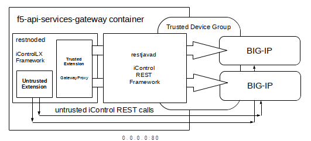
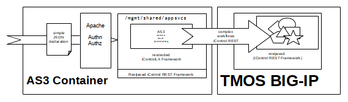

<link href="./assets/css/bootstrap.min.css" rel="stylesheet"></link>
<link href="./assets/css/f5.css" rel="stylesheet"></link>

F5 Container Based Solutions to Provision BIG-IPs
========================

1. [What is the API Services Gateway Container?](#what-is-the-api-service-gateway-container-)
2. [What is the AS3 Container?](#what-is-the-as3-container-)
3. [Why Are We Releasing New APIs and Containers?](#why-are-we-releasing-new-apis-and-containers-)
    - [Simplifying BIG-IP Orchestration Through Declarative APIs](#simplifying-big-ip-orchestration-through-declarative-apis)
    - [We Started Declaring with AS3](#we-started-declaring-with-as3)
    - [There Is Still More to Declare](#there-is-still-more-to-declare)
4. [Deep Integration into an Orchestration Ecosystem](#deep-integration-into-an-orchestration-ecosystem)
    - [The API Service Gateway Manifesto](#the-api-service-gateway-manifesto)
5. [Which Option to Choose for a Customer or Partner](#which-option-to-choose-for-a-customer-or-partner)

F5 Container Orchestration Exercises
-------------------

6. [AS3 Container Exercises](#as3-container-exercises)
    - [Exercise #1 - Downloading and Launching the AS3 Container with docker](#exercise-1-downloading-and-launching-the-as3-container-with-docker)
    - [Exercise #2 - Declaring BIG-IP Services through the AS3 Container](#exercise-2-declaring-big-ip-services-through-the-as3-container)

7. [F5 API Services Gateway Exercises](#f5-api-services-gateway-exercises)
    - [Exercise #3 - Downloading and Launching the API Services Gateway with docker](#exercise-3-downloading-and-launching-the-api-services-gateway-with-docker)
    - [Exercise #4 - Creating a Trust Between the API Service Gateway and Remote BIG-IPs](#exercise-4-creating-a-trust-between-the-api-service-gateway-and-remote-big-ips)
    - [Exercise #5 - Installing Trusted Proxy iControlLX Extension on the API Services Gateway](#exercise-5-installing-trusted-proxy-icontrollx-extension-on-the-api-services-gateway)
    - [Exercise #6 - Issuing iControl REST Requests Through the Trusted Proxy iControlLX Extension](#exercise-6-issuing-icontrol-rest-requests-through-the-trusted-proxy-icontrollx-extension)
    - [Exercise #7 - Launching Our Micro Services Deployment with docker-compose](#exercise-7-launching-our-micro-services-deployment-with-docker-compose)
    - [Exercise #8 - Installing iControlLX Extensions On Multiple Remote BIG-IPs](#exercise-8-installing-icontrollx-extensions-on-multiple-remote-big-ips)
    - [Exercise #9 - Making Trusted Declarations to Multiple Remote BIG-IPs](#exercise-9-making-trusted-declarations-to-multiple-remote-big-ips)
    - [Exercise #10 - Adding Third Party OAUTH Credentials for BIG-IP Self Service Applications](#exercise-10-adding-third-party-oauth-credentials-for-big-ip-self-service-applications)
    - [Exercise #11 - Adding Thrid Party Access Control for BIG-IP Self Service Applications](#exercise-11-adding-thrid-party-access-control-for-big-ip-self-service-applications)

8. [The API Service Gateway in Next Generation Partner Ecosystems](#the-api-service-gateway-in-next-generation-partner-ecosystems)
9. [How Can I Capitalize On Our New F5 Orchestration Containers?](#how-can-i-capitalize-on-our-new-f5-orchestration-containers-)

---

F5 now offers two container based solutions to aid in the orchestrated provisioning of BIG-IP services.

- [The API Services Gateway Container](#the_api_services_gateway_container)
- [The AS3 Container](#the_as3_container)

---

What is the API Service Gateway Container?
-------------------

The [API Service Gateway Container](https://hub.docker.com/r/f5devcentral/f5-api-services-gateway/) is a docker built container which runs both the iControl REST framework (restjavad) and the iControlLX extension framework (restnoded). 

The API Services Gateway container allows for the installation and operation of iControlLX extensions outside of a BIG-IP.  This enables opportunities for F5, or our customers and partners who are familiar with the iControlLX extensions framework, to run complex orchestration workflows in a container, rather then consuming resources on their BIG-IP's control planes.

In addition to housing iControlLX extensions, the API Services Gateway's exposes REST endpoints which can be used to create trusted device groups. These device groups, which exist solely in the container, establishes a trust between the container and remote BIG-IP devices. Local iControlLX extensions in a trusted container can make iControl REST requests to peer BIG-IP devices without providing credentials. 

Typically iControl REST requires the establishment of a disticnt session token with each device. The aquistion of the token requires knowledge of a username and password which is valid on the remote BIG-IP device. This at times has lead to *'leaking'* BIG-IP credentials to tenant processes which could inturn access the XUI GUI or make remote iControl REST calls directly to the device. 

With the API Services Gateweay, trusted REST calls are signed by the container and the signature is validated on the remote target BIG-IP. If the signature is issued from a member of our trusted device group, the request is carried out with Administrator role permissions on the remote BIG-IP. This is the same security and process used to synchronize configurations between peer TMOS devices. The API Service Gateway premits a division of labor where, once a BIG-IP administration process creates the device trust with BIG-IP credentials, subsequent processes running within the container can make trusted iControl REST requests without being concerned with BIG-IP sercurity. This confines the requirement for BIG-IP credentials to only the API Service Gateway, and then only for the processes of creating the device trust group.



*The API Services Gateway container is not a generalized API security proxy.* It is simply a way of extending our integration options in a cloud native way.

In fact, utilizing the API Services Gateway container to establish trusts removes the need for F5 security on each iControl REST call to remote BIG-IPs. When the F5 security is removed from individual requests, third party security can be used to enforce proper access controls to provision BIG-IP services. Securing access to API endpoints is a major role typically already present in service ecosystems. The API Services Gateway increases the ease of integration for provisioning F5 services to an ecosystem, but then relies on the ecosystem's native security to authorize requests made to the gateway container.

The API Services Gateway container is available with community support. As the intention of the container is to become F5's component in a ecosystem of deployed services, the supportability of the complete orchestration would naturally be beyond F5's scope. We only handle our part of the overall orchestration.


---

What is the AS3 Container?
-------------------

The AS3 Container is an F5 optimized API Service Gateway which has the AS3 iControlLX extension pre-installed.

The AS3 Container does not utilize device group trusts. F5 device level authentication and authorization for iControl REST calls to remote BIG-IP devices is still enforced by each BIG-IP device. The credentials for remote target AS3 deployments are included in the tenant declarations posted to the AS3 container. 

The AS3 container is only intended to support the pre-installed AS3 iControlLX extension. The customer should not expect to extend or alter the AS3 container in any way. You run it and use it.

Because the AS3 container's functionality stands alone, without any dependencies on the customer's ecosystem of services, it can be maintained as a fully supported F5 product.



---

Why Are We Releasing New APIs and Containers?
-------------------

For the most part, we have successfully migrated our customers and partners who are interested in orchestration to iControl REST. Why introduce new APIs for BIG-IP?

---

### Simplifying BIG-IP Orchestration Through Declarative APIs ###

As BIG-IP administration increasingly becomes the job of automation, rather than human administrator interaction, focusing our efforts on simple declarative API interfaces will help our customers standardize their BIG-IP services, increases the agility of operations, and open the orchestration of the TMOS platform to a much larger ecosystem of external cloud services.

For human administrator's, F5 has augmented the ease of use of TMOS devices in many ways. The XUI Web Graphical Interface performs complex provisioning workflows in behalf of the administrator. The TMSH CLI client uses smart tab completion to assist the administrator with available options for provisioning tasks.


The complexities of remote provisioning BIG-IP services through iControl REST APIs has been a major hurdle for our customers in their efforts to automated. In our traditional 'programmable' fashion, F5 introduced a scriptable framework allowing BIG-IP experts to take very complex provisioning interactions, or workflows, and expose them to non-F5 expert API tenants in a simplified way. The scripting language chosen was javascript. The APIs are made available as URL namespace extensions to the existing iControl REST URL schemas.

```
/mgmt/shared/{{simplified API namespace}}
```

The interaction of the scripted workflows with the existing iControl REST API is handled through a set of javascript objects. These objects were called the *iControlLX extension framework*. In addition, web based UI extensions were enabled, called iAppsLX, allowing the F5 experts to define custom UI elements which can be accessed as part of the BIG-IP device's XUI web graphical interface.

[iControlLX Documentation](https://clouddocs.f5.com/products/iapp/iapp-lx/tmos-14_0/) is part of the clouddocs.f5.com effort.

As APIs access is the mechanism used in orchestrations, we will not discuss iAppsLX graphical presentations.

Just because a framework exists, like iControlLX extensions, does not mean that the API endpoints exposed by that framework are easy to use. To that end, F5 began to follow a trend in orchestrated provisioning known as *'declarative interfaces'*. In general, declarative interfaces no longer require the end user to understand the stages and processes by which a system achieves a deployment, but rather simply defines the end service state of a system. 

Here is a an example of a YAML declarative deployment for a containerized proxy using the Kubernetes orchestrator.

```YAML
apiVersion: apps/v1
kind: Deployment
metadata:
  name: nginx-deployment
  labels:
    app: nginx
spec:
  replicas: 3
  selector:
    matchLabels:
      app: nginx
  template:
    metadata:
      labels:
        app: nginx
    spec:
      containers:
      - name: nginx
        image: nginx:1.7.9
        ports:
        - containerPort: 80
```

Notice there is nothing in the YAML declaration which pertains to the steps to take in the proxy's configuration or entries in configuration files. The point of the declarative interface is to decouple and free the API tenant from any such concerns. This notion of decoupling is known as *'separation of concerns'* and is a basic concept in cloud ready deployments. In cloud, you decompose your systems into independent service interfaces which are only concerned about their part of the overall solution. As as system decomposes into smaller and smaller chunks of system functionality, these decomposed interfaces are referred to as *'micro services'*.

---

### We Started Declaring with AS3 ###

Application Services 3 Extension (AS3) is the first supported declarative API for BIG-IP. AS3 endeavors to expose many advanced BIG-IP services while still hiding as many of the 'BIG-IP concerns' as possible. AS3 is an iControlLX extension which, once installed on a system supporting the iControlLX framework, can be accessed at the iControl REST endpoint:

```
/mgmt/shared/appsvcs
```

[Application Services 3 Extension Documentation](https://clouddocs.f5.com/products/extensions/f5-appsvcs-extension/3/) is part of the clouddocs.f5.com effort.

The AS3 iControlLX extension endpoint accepts a declaration defined by a standards based [JSON schema](https://json-schema.org). AS3 JSON schema allows for an entire BIG-IP's data plane services to be deployed through one declaration, in one REST call. The AS3 JSON schema includes the ability to define multiple tenants. We call the divisions tenants, verses the BIG-IP concept of partitions, because the API user should not be concerned that BIG-IP has partitions. In cloud, these divisions are typically defined as tenants, not partitions. In fact, if BIG-IP stopped supporting separations with partitions, the API definition of a tenant could remain unchanged. We are quite careful when we define the schema of our declarative APIs to make sure the concepts can be preserved as we pivot to our next generation of application delivery products.


AS3's is constantly being enhanced to include declaration attributes which enable more BIG-IP services. AS3's aggressive agile based development cycle allows for the release of new AS3 versions on a much shorter release cycle than a full TMOS release. The development team demonstrates and tests new functionality for AS3 every two weeks.

---

### There Is Still More to Declare ###

Other declarative iControlLX extensions are being developed to simplify additional complex TMOS tasks. As an example, AS3 performs extensive validation before implementing its workflows. There are times where AS3's design might not lend itself to the frequency of automation requests possible in an given ecosystem. For such situations, other declarative APIs could work with AS3 to allow for rapid interaction with specific BIG-IP service objects.

As another example, AS3 does not handle any system-wide onboarding tasks. Other declarative APIs are being developed to handle those type of orchestration requests.

When complex orchestration tasks can be built into standalone micro services, supported containers, like the AS3 container, can become the release packaging. The AS3 container is an example of a standalone micro service just for AS3. Another example of a proposed standalone micro service we are considering, is a container build which unifies the creation and auto-scaling of TMOS VEs in multiple cloud environments. The intent for all such future standalone container builds is to provide simple *'run and then use'* orchestrations.

All of our declarative APIs and micro service container builds follow the same aggressive development process. Our aim is to be able to provide the simplicity necessary for F5 services to function well in orchestrated environments at the agile pass of our customer's cloud native deployments. 

---

Deep Integration into an Orchestration Ecosystem
-------------------

When declarative iControlLX services are deployed on existing TMOS platforms, they inherit TMOS' system level services, including network access, authentication services, and defined role based authorization. This works well where existing TMOS configurations for corporate identity, like active directory, and network access systems, like established network firewall policies, are already available. However, TMOS' lack of support for cloud native identity systems, TMOS' notions of roles, and the inflexibility of TMOs' tenancy model make integration in the increasingly opinionated world of cloud orchestation extremely cumbersome.


When TMOS forces the exposure of BIG-IP concepts to cloud service API tenants, we are not properly observing *'separation of concerns'* for our customers. The cloud won't change for F5, F5 needs to change for the cloud.

In the past F5 has tried to accommodate specific partner ecosystem deployments, for example Cisco APIC or OpenStack Neutron. We did this by creating dedicated agent processes which work inside of the partner's controllers to *translate* requests into the workflows needed to provision BIG-IPs. Partner feature dependencies and multiple version testing have proven extremely fragile and complex to maintain.  Fortunately, the technology world had the same problem we did, that of supporting the lifecycle of their sofrware in the diversity of cloud services. A better way to handle software deployments in complex ecosystems based on process virtualization has take over our industry. *Containerization*!

What can F5 do to enable deep integration now that ubiquitous containerization has become available in our customer's environments?

*We create our own containers which hides as many of the complexities of integrating with TMOS platforms as possible. That is the reason for the generalized [API Service Gateway Container](https://hub.docker.com/r/f5devcentral/f5-api-services-gateway/). The API Service Gateway container can be integrated into micro service based controllers in ways that make orchestrated provisioning of TMOS devices appear native to the customer's services. Because of containerization, we can combine the simplicity of our new iControlLX extension declarative APIs with partner ecosystems services without forcing a costly and fragile deployment of one-off, ecosystem specific F5 agents.* 

---

### The API Service Gateway Manifesto ###

#### **_Our customers should be able to utilize the advanced services we offer with BIG-IP without being concerned about the TMOS system complexities we use to deploy those services._** ####

The marriage of housing our declarative iControlLX extensions and the ability to establish trusted communications with remote BIG-IPs make the API Services Gateway the basis for building F5's components within an ecosystem's orchestrated deployment of containers.

---

Which Option to Choose for a Customer or Partner
-------------------

#### F5 BIG-IQ is the *out of the box* solution for BIG-IP management. ####

- *If a customer wants a graphical user interface to manage BIG-IP devices, BIG-IQ provides that interface.*

- *If a customer wants the ease of use declarative APIs for BIG-IP services available on an F5 managed platform, BIG-IQ 6.1 adds AS3 API endpoints for BIG-IQ managed devices. BIG-IQ will deploy AS3 on remote BIG-IPs and will apply analytics to AS3 declared services.*

#### If your customer or partner is looking for a simplified way to fully control the provisioning of BIG-IPs as part of their own orchestrated services, we now offer container based solutions. ####

- *If a customer wants a standalone way to provision BIG-IP services through a declarative API, the AS3 container performs that function.*

- *If a customer or partner needs deep integration of BIG-IPs services into an ecosystem of cloud services, the API Service Gateway provides the basis for F5's components of such a solution.*

### Summary of Solutions ###

| F5 Solution                           | Support Model| Usage                                                              |
| :------------------------------------ | :----------- | :----------------------------------------------------------------- |
| F5 BIG-IQ                             | Full         | Full Device Management with a Graphical Environment                |
| F5 BIG-IQ with AS3                    | Full         | Full Device Management with the Ease of Use Declarative API        |
| F5 AS3 Container                      | Full         | Ease of Use Declarative API as a Stand Alone Micro Service         |
| F5 API Services Gateway &nbsp; &nbsp; | Community    | F5's Components of an Integration into an Cloud Services Ecosystem |

---

F5 Container Orchestration Exercises
========================

---

AS3 Container Exercises
-------------------

---

We will deploy the AS3 Container and then declare a BIG-IP device configuration.

In these exercises you will need:

- A target BIG-IP system whose management address is reachable from the container
- Administrative role credentials to the BIG-IP
- The ability to launch a container with ```docker```

---

### Exercise #1 - Downloading and Launching the AS3 Container with ```docker```

Step 1. Create a SSH connection to the F5 Container Demonstration Virtual Device

Step 2. Pull the AS3 Container from Dockerhub

Step 3. Create a running instance of the AS3 Container

### Exercise #2 - Declaring BIG-IP Services through the AS3 Container

Step 1. Vaidate the version of the AS3 iControl Extension in the AS3 Container

Step 2. Get any existing AS3 declaration on a remote BIG-IP

Step 3. Issue an AS3 declaration to the a remote BIG-IP

---

F5 API Services Gateway Exercises
-------------------

---

We will go through a series of exercises which illustrate the uses of the [API Service Gateway Container](https://hub.docker.com/r/f5devcentral/f5-api-services-gateway/) as a place to install and use iControlLX extensions and as a trusted gateway to remove BIG-IP concerns from a complex ecosystem integration.

In these exercises you will need:

- A target BIG-IP system whose management address is reachable from the container
- Administrative role credentials to the BIG-IP
- The ability to launch a container with ```docker```

---

### Exercise #3 - Downloading and Launching the API Services Gateway with ```docker```

Step 1. Create a SSH connection to the F5 Container Demonstration Virtual Device


Step 2. Pull the API Services Gateway Container from Dockerhub


Step 3. Create a running instance of the API Services Gateway


### Exercise #4 - Creating a Trust Between the API Service Gateway and Remote BIG-IPs

Step 1. Make a iControl REST POST request to add a tusted remote BIG-IP


Step 2. Query the status of the device trust to assure it is ACTIVE


### Exercise #5 - Installing Trusted Proxy iControlLX Extension on the API Services Gateway

Step 1. Upload the Tusted Proxy iControlLX Extension RPM file to the API Services Gateway Container


Step 2. Make an iControl REST POST request to initiate an install task for the Trusted Proxy iControlLX Extension in the API Services Gateway Container


Step 3. Make an iControl REST POST request to initiate a query task for iControlLX Extensions in the API Services Gateway Container


Step 4. Make an iControl REST GET request to retrieve the results of your query task


### Exercise #6 - Issuing iControl REST Requests Through the Trusted Proxy iControlLX Extension

Step 1. Make an iControl REST GET request through the Trusted Proxy iControlLX Extension to a remote BIG-IP without credentials. 

```
NOTE: Stop both the AS3 Container and the API Service Gateway Containers before progressing to the next step

docker stop AS3Container
docker stop APIServicesGateway
```

---

In the following exercises we are going to illustrate the use of your trusted device through an orchestration application. The orchestration application is made up of multiple micro services. We are going to launch all of these micro services as a single deployment using ```docker-compose```

In these exercises you will need:

- At least one target BIG-IP system whose management address is reachable from the container
- Administrative role credentials to the BIG-IP
- The ability to launch a deployment of containers using ```docker-compose```

### Exercise #7 - Launching Our Micro Services Deployment with ```docker-compose```

Step 1. Running ```docker-compose``` 

Step 2. Validate the Demonstration app is running querying the OpenAPI Documentation user interface

Step 3. Adding a initial User Administrator user to our demonstration application

Step 4. Adding the BIGIP Administrator role to our demonstration application user

Step 5. Adding a remote BIG-IP as a Trusted Device

Step 6. Making a trusted iControl REST to the our application Device

Step 7. Adding a Deployment including our Device

Step 8. Making a trusted iControl REST to our application Deployment


### Exercise #8 - Installing iControlLX Extensions On Multiple Remote BIG-IPs

Step 9, Uploading the AS3 iControlLX Extension to the demonstration application

Step 10. Uploading the AS3 iControlLX Extension to a Deployment


### Exercise #9 - Making Trusted Declarations to Multiple Remote BIG-IPs

Step 11. Get the version of the AS3 iControlLX Extension on all the Devices in your Deployment

---

In the following exercises we are going to utilize open standards based services already deployed as part of our demonstration orchestration deployment to restrict access to our declarative iControlLX extensions. We are going to authorize access via OAUTH to third party systems. Systems granted OAUTH credentials must maintain proper token security to a non-F5 component in our ecosystem in order to access our declarative APIs. This demonstrates how control of BIG-IP devices can be delegated securely to native components in a third party ecosystem.

For these exercises, you must have completed exercises 7-9.

### Exercise #10 - Adding Third Party OAUTH Credentials for BIG-IP Self Service Applications

Step 12. Adding a Client ID 

Step 13. Authorizing our Declaration to our Client 

Step 14. Using our Client ID to make our Declaration

### Exercise #11 - Adding Thrid Party Access Control for BIG-IP Self Service Applications

---

TODO: Add Steps to Build an IAM Role Policy and Use that to secure our declaration


The API Service Gateway in Next Generation Partner Ecosystems
========================

How do we keep up with rapidly developing service deployments in our every changing orchestration environments? We're betting on the ability to launch our containerized services. Our containerized services allow our customers to build distributed controllers which include secured access to BIG-IP provisioning. Our orchestration efforts become decoupled from partner dependencies and releases through iControlLX extensions declarative APIs. The internal workings of BIG-IP trusted access, iControl REST workflows, or even our ability to pivot to non-TMOS application delivery systems, can be masked from the partner ecosystem by consistent and maintainable declarations.

Perhaps you are thinking this sounds like how other container orchestrators, like Kubernetes, handle deployments. Exactly! We are meeting the market where it is and, hopefully, where it is going. REST APIs were a great step in providing standardized protocol access without proprietary agents. The next phase was providing declared services which integrate directly into containerized application deployments. If you did the exercises above, then you've already seen how this all works together. The API Service Gateway provides the basis to greatly simply access to F5 services and build out a fully integrated ecosystem.

---

How Can I Capitalize On Our New F5 Orchestration Containers?
========================

There are multiple ways:

- Start educating your customers on the use of AS3 declarations. This prepares them for cloud ready orchestration.

- Wait for F5 to release API Service Gateway controller services for specific ecosystems like APIC and OpenStack

- Present the API Service Gateway to your customers who need to develop deep integration for BIG-IP provisioning now.

The exercises above were your introduction to ready yourself for cloud native orchestration. Some customers are already expecting you to understand these concepts. Other customers' migration to cloud services might still be simply a plan. Either way, you can be ready to help them now.

---